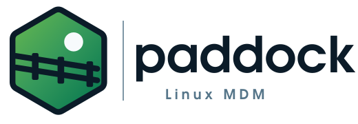
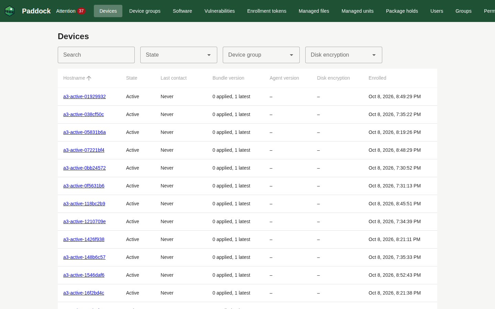
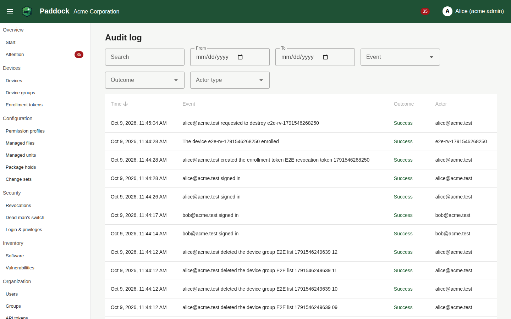

<p align="center">
  <picture>
    <source media="(prefers-color-scheme: dark)" srcset="docs/assets/logo/paddock-horizontal-dark.svg">
    
  </picture>
</p>

# Paddock

Open-source management for Linux workstations that keeps local administrator rights with their users.

Paddock distributes signed configuration to Linux laptops and desktops, manages identity and device login
(Authentik and Himmelblau), sudo rights from permission profiles, a managed local administrator, disk encryption
with TPM2, boot PIN and escrowed recovery keys, updates and inventory (Fleet), detects tampering and keeps a
tamper-evident audit trail for ISO 27001 (WORM storage, signed daily hash chain). Devices only ever talk to the
server on their own initiative, and keep working when it is unreachable. Users keep the administrator rights their
organization grants them; Paddock makes those rights explicit, reviewable and audited. The portal speaks English
and German.

<p align="center">
  <picture>
    
  </picture>
</p>

<p align="center">
  <picture>
    
  </picture>
</p>

> [!WARNING]
> **Alpha.** Paddock 0.1.0-alpha.1 is the first public pre-release (milestones M0–M6b), meant for evaluation, not
> for production fleets. There are no upgrade guarantees between alpha releases. Revocation (Lock, Destroy, dead
> man's switch) stays disabled behind `PADDOCK_REVOCATION_ENABLED` until its code has passed the second-person review
> and an installation has passed its hardware acceptance (`docs/operations/revocation-acceptance.md`).

| Read | For |
| --- | --- |
| [Production installation](docs/operations/install.md) | operators: two hosts, TLS, secrets, backups, monitoring, `make prod-check` |
| [Operations runbooks](docs/operations/) | day-to-day operation: agent releases, disk recovery, revocation, restore, capacity |
| [Compliance pack](docs/compliance/) | auditors: [ISO 27001 mapping](docs/compliance/iso27001-mapping.md), [residual risks](docs/compliance/residual-risks.md), [audit codes](docs/compliance/audit-codes.md), [privacy](docs/compliance/privacy.md), [third-party licenses](docs/compliance/third-party.md) |
| [CHANGELOG](CHANGELOG.md) | what changed per release |
| [Architecture](docs/architecture.md), [decisions](docs/adr/), [plans](docs/plans/) | contributors; binding rules for contributors and AI agents: `CLAUDE.md` |

## Quick start (local development)

Prerequisites: Docker Engine with Compose v2, GNU make, Go 1.21 or newer (fetches the declared Go 1.27.2 toolchain
automatically). Node is not needed on the host. Free ports: `8443` and the loopback ports listed in
`docs/operations/local-dev.md`.

```sh
make dev-secrets   # random secrets in deploy/compose/.secrets/ and settings in deploy/compose/.env
make up            # builds the paddock-server image, starts everything, initializes OpenBao and the buckets
make dev-seed      # creates the organizations acme and globex and assigns the test users
```

`make up` takes a few minutes on the first run (image pulls, Authentik migrations). It is idempotent; after a
restart of the machine run it again (it also unseals OpenBao). `make bao-bootstrap`, `make audit-bootstrap` and
`make bundles-bootstrap` exist as separate targets but are already part of `make up`.

Open <https://admin.paddock.localhost:8443>. Devices talk to <https://device.paddock.localhost:8443> and download
bundles from <https://bundles.paddock.localhost:8443>. The certificate comes from Caddy's internal CA
(`deploy/compose/.secrets/caddy-root.crt`); accept the warning or import that certificate.

### Test accounts

Passwords are generated per checkout; read them from `deploy/compose/.secrets/`.

| User | Role | Password file |
| --- | --- | --- |
| `platform-admin@paddock.test` | Platform administrator | `dev_platform_admin_password` |
| `alice@acme.test` | Administrator of `acme` | `dev_alice_password` |
| `bob@acme.test` | Auditor of `acme` | `dev_bob_password` |
| `carol@globex.test` | Administrator of `globex` | `dev_carol_password` |

The Authentik admin interface is at <https://auth.paddock.localhost:8443/if/admin/> (user `akadmin`, password in
`authentik_bootstrap_password`).

## Make targets

| Target | Purpose |
| --- | --- |
| `make lint` | golangci-lint, `go vet`, OpenAPI contract lint, govulncheck, the license gate, ESLint, the message catalog check and vue-tsc for the portal |
| `make test` | Go unit and integration tests (Docker test containers) and portal unit tests |
| `make gen` | sqlc, oapi-codegen, audit code document (`docs/compliance/audit-codes.md`), TypeScript API types |
| `make web` | Builds the portal into `server/web/dist` (in the pinned Node container) |
| `make image` | Builds the `paddock-server:dev` image |
| `make acceptance` | Acceptance gates against the running stack (`T=<regex>` to select, e.g. `T=TestWORM`) |
| `make e2e` | Playwright end-to-end tests against the running stack (builds `bin/devicesim` and `bin/agentrelease` first) |
| `make agent` / `make deb` | Builds `paddockd` and `paddock-supervisor` (amd64, arm64) / the Debian packages for amd64 (`VERSION=`, `TAGS=`) |
| `make agent-release VERSION=x.y.z` | Builds, signs (development release key) and uploads an agent release (`TAGS=` for test builds) |
| `make system-test VM=<vm\|all>` | Agent system tests on the VirtualBox VMs of `test/vms/virtualbox` against the running stack (`T=<regex>`); `VM=paddock-ai-2604 T=TestAutoinstallGate` builds a throwaway VM from a Paddock autoinstall (gate D-AI, about an hour) |
| `make load-identities` / `make load-test` | Load test devices and the k6 scenarios `checkin` and `ingest` (`docs/operations/capacity.md`) |
| `make release-artifacts` / `make release-sign` | Release images, unsigned agent packages, SBOMs and checksums / cosign signatures (`docs/operations/agent-releases.md`) |
| `make fuzz` | Fuzz tests of `pkg` (`FUZZTIME=30s` per target by default) |
| `make logs` / `make down` | Logs of the stack / stop it (`make down V=1` also deletes all volumes) |

`make ci` runs `lint test web`. The acceptance gates are the definition of done (`CLAUDE.md`); run
`make up dev-seed acceptance` before declaring a milestone finished.

## Repository layout

```
api/openapi/admin.yaml   admin API contract (source of truth)
api/openapi/device.yaml  device API contract
server/                  paddock-server (Go): cmd, internal packages, migrations, web/ (Vue portal)
pkg/                     Go module shared with the agent: device protocol, DSSE, canonical JSON, bundle schema, path policy
agent/                   paddockd (agent) and paddock-supervisor (Go, static binaries)
packaging/               nfpm configurations, systemd unit and maintainer scripts of the agent packages
deploy/compose/          Compose stack, pinned image versions, bootstrap scripts
test/acceptance/         acceptance gates, the reference device client devicesim and the release uploader
test/system/             system tests of the agent packages on the test VMs
test/load/               k6 load scenarios and the load test identity generator
docs/                    architecture, ADRs, plans, operations runbooks, compliance
```

## License

MIT — see [LICENSE](LICENSE).
