# Paddock – Technical Architecture

Status: **Proposed** · Version 1.2 · 2026-10-03 · Basis: `docs/reqirements/00_concept_v1.md` (Product Concept v1)

This document turns the product concept into a technical architecture. It answers the delegated
decisions A1–A14 (or states why one stays open), fixes the technology stack, and defines the
contracts every component must honour. Directional decisions are recorded as ADRs in `docs/adr/`;
this document is the overview that ties them together.

Binding language: **MUST** / **MUST NOT** are requirements, **SHOULD** is a recommendation that
needs a documented reason to deviate, **MAY** is a genuine degree of freedom.

---

## Contents

1. [Decisions at a glance](#1-decisions-at-a-glance)
2. [Requirements consolidation](#2-requirements-consolidation)
3. [System context and building blocks](#3-system-context-and-building-blocks)
4. [Deployment topology](#4-deployment-topology)
5. [Organization isolation](#5-organization-isolation)
6. [Device identity and the agent–server protocol](#6-device-identity-and-the-agentserver-protocol)
7. [State compilation and bundle delivery](#7-state-compilation-and-bundle-delivery)
8. [Asynchronous ingest](#8-asynchronous-ingest)
9. [Identity, users, and login](#9-identity-users-and-login)
10. [Permission profiles and sudo](#10-permission-profiles-and-sudo)
11. [The agent](#11-the-agent)
12. [Device controls](#12-device-controls)
13. [Key management](#13-key-management)
14. [Audit pipeline](#14-audit-pipeline)
15. [Fleet and osquery integration](#15-fleet-and-osquery-integration)
16. [Data model](#16-data-model)
17. [APIs](#17-apis)
18. [Portal and internationalization](#18-portal-and-internationalization)
19. [Observability](#19-observability)
20. [Backup and restore](#20-backup-and-restore)
21. [Version compatibility](#21-version-compatibility)
22. [Test strategy](#22-test-strategy)
23. [Repository layout](#23-repository-layout)
24. [Milestones](#24-milestones)
25. [Open points and risks](#25-open-points-and-risks)

---

## 1. Decisions at a glance

| Topic | Decision | ADR |
| --- | --- | --- |
| Server language | Go (same toolchain as agent, CLI, shared protocol packages) | [0001](adr/0001-go-for-server-agent-and-cli.md) |
| Persistence and org isolation | PostgreSQL 17, isolation by Row-Level Security set in one repository layer | [0002](adr/0002-postgresql-with-row-level-security.md) |
| Queue and async processing (A8) | RabbitMQ (quorum queues, no plugins) for ingest and internal events; Valkey for the gateway's hot read path, nonces and locks. Both map 1:1 to managed AWS services (Amazon MQ for RabbitMQ, ElastiCache for Valkey) | [0003](adr/0003-rabbitmq-and-valkey.md) |
| Agent–server protocol and identity (A5, A6) | HTTPS on 443, per-request signatures with a device key (TPM-bound where available), end-to-end signed payloads | [0004](adr/0004-device-identity-and-protocol.md) |
| State compilation (A9) | Event-driven compiler, DSSE-signed per-device bundles in object storage, served through short-lived presigned URLs | [0005](adr/0005-state-compilation-and-bundle-format.md) |
| Key management (A3) | OpenBao Transit, one key and one access policy per purpose; agent release key offline | [0006](adr/0006-key-management-with-openbao.md) |
| Authentik mapping (A1) | One shared Authentik instance; one application and group tree per Paddock organization; lock by policy group | [0007](adr/0007-authentik-organization-mapping.md) |
| sudo ownership (A13) | Paddock alone; Himmelblau never grants sudo; sudo-granting local groups are reconciled | [0008](adr/0008-sudo-ownership.md) |
| Fleet depth (A10) | Fleet behind an `inventory` port; Paddock owns its own normalized model | [0009](adr/0009-fleet-integration-depth.md) |
| Audit storage | Outbox → RabbitMQ → PostgreSQL audit index (separate DB) + WORM object storage with signed daily hash chain | [0010](adr/0010-audit-pipeline.md) |
| Configuration source of truth | PostgreSQL with versioned change sets; declarative YAML API used by portal and `paddockctl`; optional Git export | [0011](adr/0011-configuration-source-of-truth.md) |
| Apply engine on device | Native Go reconcilers for a fixed resource set; optional Ansible `playbook` resource, off by default | [0012](adr/0012-agent-apply-engine.md) |
| Version compatibility (A7) | Protocol `/v1`, bundle schema versions, support window N-2 minor / 6 months | [0013](adr/0013-version-compatibility.md) |
| Mass-revocation protection (A4) | Revocation issuer as separate role; approvals carry Authentik step-up ID tokens; hard rate limits | [0014](adr/0014-mass-revocation-protection.md) |
| Portal | Vue 3 + TypeScript SPA, BFF cookie session, ICU messages via FormatJS | [0015](adr/0015-portal-frontend.md) |
| Backup (A11), Observability (A12), Deployment | pgBackRest + OpenBao snapshots; OpenTelemetry + Prometheus; Docker Compose in v1, Kubernetes-ready | [0016](adr/0016-operations-backup-observability-deployment.md) |
| User lock on the device (F2) | Two paths: Authentik for online logins, agent blocks locally at the next check-in (event-triggered on network-up and resume) and locks active sessions | – (§9.5) |
| Object storage product | RustFS (accepted), S3 API with Object Lock only; gated by the WORM acceptance test | [0017](adr/0017-object-storage-product.md) |
| Device-group scope for profiles | Profile assignments may be limited to a device group | [0008](adr/0008-sudo-ownership.md) |
| Himmelblau (A2) | Stays open until the PoC gate passes. Fallback SSSD is designed for | – |
| Boot PIN / login PIN (A14) | Stays open until the UX test. Both are supported technically; offered per organization | – |

---

## 2. Requirements consolidation

### 2.1 Findings in the concept

The concept is consistent in its direction. The following points are contradictions, gaps or
ambiguities that this architecture resolves; the chosen resolution is binding unless the product
owner objects.

| # | Finding | Resolution |
| --- | --- | --- |
| K1 | The architecture diagram says devices authenticate against the identity service (Authentik). Two different identities are involved: the *user* logging in at the device and the *device* talking to the control plane. | **Confirmed by the product owner:** user logins at the device go through Himmelblau against **Authentik**, which already provides MFA flows and brokering to upstream IdPs. The **device itself** (agent) authenticates against **Paddock** with its own device key and exchanges all other data and configuration with Paddock only (§6). ADR 0004. |
| K2 | F5 says revocation takes effect "no later than the device's next contact"; stage 1 (lock the user) takes effect only "after the offline window". | **Decided by the product owner:** a user lock also takes effect **on the device at its next contact**, independent of Authentik and of the offline window: the agent blocks the user locally and sends active sessions to the lock screen (§9.5). Keyslot erasure (stage 2) likewise starts at the next contact. The concept's "Lock propagation" table is superseded by §9.5. |
| K3 | C3 excludes Arch Linux from v1; the environment section and patch management still mention Arch VMs and `pacman.conf`. | v1 builds and tests **Ubuntu LTS only**. The resource model keeps a `distro` abstraction so pacman can follow; no Arch code in v1. |
| K4 | The dead man's switch period must be "at least the offline login window" (F3), but the offline window is owned by Himmelblau. | The portal derives the minimum from the Himmelblau offline setting it ships in the bundle (`dms.period_days ≥ ceil(offline_window)` + 1 day). |
| K5 | "Everything as code / the portal writes through the same path" vs. a database-backed portal. | Decided by the product owner: **database is primary**; portal and `paddockctl apply` use the same declarative API; Git is an optional export. ADR 0011. |
| K6 | "Lock propagation" heading appears twice in the concept. | Editorial; no architectural impact. |
| K7 | "Devices fetch only deltas or changed bundles" (A9). | Bundles are small (target < 256 KiB). Devices fetch **changed bundles only**, never deltas. Delta encoding is a non-goal for v1. |
| K8 | The managed local administrator password confirmation and the revocation confirmation both look like synchronous writes, which principle 3 forbids. | Both go through the queue; the agent learns the outcome through a **read** endpoint (§12.2, §12.3). |
| K9 | TPM2+PIN with `systemd-cryptenroll` requires a systemd-capable initramfs. Ubuntu 24.04 uses `initramfs-tools`, which does not support TPM2 unlock through `systemd-cryptenroll`; newer Ubuntu releases ship `dracut`. | Primary target is **Ubuntu 26.04 LTS** (dracut). Ubuntu 24.04 is supported only with dracut installed by the Paddock autoinstall. Verified in the PoC (§25). |
| K11 | The concept's repository layout lists `ansible/roles/`. | **Confirmed:** the product repository contains no operator configuration; at most examples under `examples/` (§23). |
| K10 | Shared devices are open, but device-to-person assignment drives login allow lists, audit attribution and revocation. | Every device has a **login assignment** (users and/or groups). Default at enrollment: the enrolling user only. Shared devices get a group assignment. §9.4. |

### 2.2 Consolidated requirements with acceptance criteria

The concept's IDs are kept. Each criterion names the role that must be able to observe the result.

| ID | Acceptance criterion (Given / When / Then) | Observed by |
| --- | --- | --- |
| F1 | Given a device with applied bundle *n*, when a protected or managed file is changed locally, then within one check-in interval the agent restores the desired state and a `config.drift_corrected` event appears in the device's audit trail. A second apply run changes nothing. | Org admin in portal |
| F2 | Given an active user, when an admin locks the user, then (a) the next online login of that user on any device of the organization fails through Authentik, and (b) every device on which the user may log in blocks the user locally at its next check-in (≤ 6 min with jitter, immediately after network-up or resume): active sessions of the user go to the lock screen and cannot be unlocked, new logins — including offline logins with cached credentials — are refused. Unlock reverses (b) at the next check-in. The portal shows per device whether the lock is applied (`user.lock.applied` event). | User at device; org admin |
| F3 | Given a user who logged in online once, when the device is offline, then the user can log in as Himmelblau's offline mechanism permits with the settings Paddock shipped. | User at device |
| F4 | Given an enrolled device, when Fleet has processed its inventory, then the portal lists installed packages and matching CVEs with severity per device and per package. | Org admin |
| F5 | Given a Lock or Destroy command, when the device next checks in, then keyslots are erased, the confirmation is stored before the reboot, and the portal shows `revocation.confirmed`; a device that never returns is shown as `revocation.pending` with the elapsed time. | Org admin, auditor |
| F6 | Given an organization update policy, then security updates are installed daily and regular updates per schedule; a hold prevents the package from being upgraded on all devices after their next sync; an immediate install executes within one check-in interval. The portal shows per device the last update run and its result. | Org admin |
| F7 | Every privileged action from portal, API, CLI, identity and agent produces exactly one audit event in the WORM store, including failed actions. | Auditor |
| F8 | Only users with a Paddock admin role can sign in to the portal; all others are denied with no data shown. | Any user |
| F9 | Changes to protected areas (§11.6) produce a tamper event within one check-in interval after the device is online. | Org admin, auditor |
| F10 | A request for any resource of another organization returns 404 on every API path. | Automated test; org admin |
| F11 | The portal shows each user's effective profile with its derivation; the device receives a `sudoers.d` file that passes `visudo -c` and grants exactly the effective rights. | Org admin; user at device (`sudo -l`) |
| F12 | The portal shows last contact per device; crossing warning or critical threshold creates an alert and an audit event. | Org admin |
| F13 | Synced users and groups are visibly marked and their upstream-owned attributes are read-only in portal and API (API returns 409 `attribute_owned_upstream`). | Org admin |
| F14 | With the switch enabled, a device without authenticated contact for the configured period warns the logged-in user at the configured lead times and then locks; with it disabled, nothing happens. | User at device; org admin |
| F15 | Suspend and unsuspend take effect within one check-in interval; directory-user sessions are terminated; the managed local admin can still log in. | User at device; operator with device in hand |
| F16 | Every device has the managed local admin account; rotation never leaves an unknown password; every reveal requires step-up and is audited. | Org admin; auditor |
| F17 | Devices check in every 300 s ± 20 % jitter; on failure with exponential back-off up to 30 min. | Platform operator (metrics) |

### 2.3 Non-functional requirements added

| ID | Requirement |
| --- | --- |
| N1 | **Check-in cost:** one authenticated request per device per interval in steady state; p99 latency < 200 ms at 1 000 check-ins/s per gateway node. |
| N2 | **Ingest:** at-least-once, idempotent consumers; sustains 5 000 events/s with 3 worker replicas (reference load test). |
| N3 | **Availability:** control plane target 99.5 % monthly; devices are unaffected by outages (C2). |
| N4 | **Security:** all external traffic TLS 1.3 (1.2 allowed for device gateway behind legacy proxies); no plaintext signing or escrow key on any application node. |
| N5 | **Privacy:** the negative list of the concept (no commands, processes, network connections, …) is enforced by schema: ingest rejects unknown event types. |
| N6 | **Localization:** no user-visible string in the portal is hard-coded; CI fails on missing English keys. |

---

## 3. System context and building blocks

### 3.1 Context

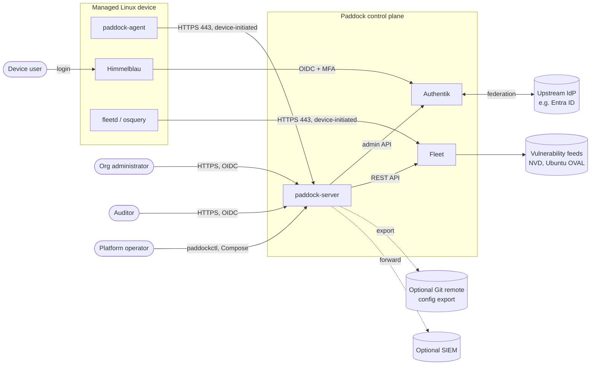

All arrows from the device point outward. No component of the control plane opens a connection to a device.

### 3.2 Building blocks

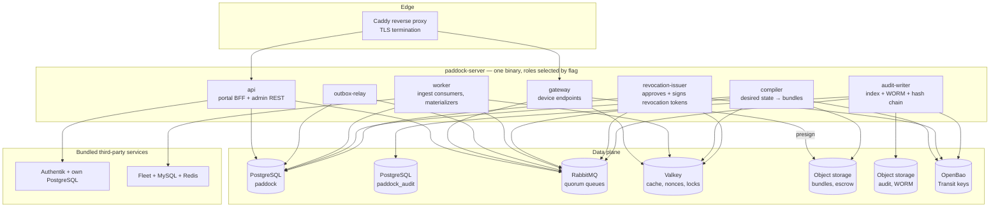

| Role | Responsibility | Scales by | Keys it may use |
| --- | --- | --- | --- |
| `api` | Portal BFF (OIDC session), admin REST API, `paddockctl` API; writes configuration and commands in one DB transaction with an outbox record | replicas behind proxy | none (escrow reveal via `escrow-reader` policy, see §13) |
| `gateway` | Device endpoints: enroll, check-in, events, results, escrow upload; verifies device signatures; reads only from Valkey; writes only to RabbitMQ (and nonces to Valkey) | replicas | none |
| `worker` | Consumes ingest queues, materializes device status and the Valkey cache, inventory sync with Fleet, staleness evaluation, Authentik sync | competing consumers on quorum queues | `command-signing` |
| `compiler` | Recomputes effective state on input change, renders and signs bundles | consumer replicas, partitioned by organization | `bundle-signing`, `time-ticket` |
| `revocation-issuer` | Validates approvals, enforces rate limits, signs revocation tokens | exactly 1 active replica (leader lease) | `revocation-signing` |
| `audit-writer` | Writes audit index and WORM objects; daily signed hash chain | consumer replicas; chain sealing by leader | `audit-chain` |
| `outbox-relay` | Moves outbox rows from PostgreSQL to RabbitMQ (publisher confirms) | 1–2 replicas (row locking) | none |

One binary with roles keeps the build, versioning and security review in one place while every role
scales and is privileged independently. Each role gets **its own OpenBao AppRole and its own database
role**; a compromised `gateway` cannot sign bundles, a compromised `api` cannot sign revocation tokens.

### 3.3 Module structure inside `paddock-server`

Dependency direction is strictly downward; `domain` packages never import adapters.

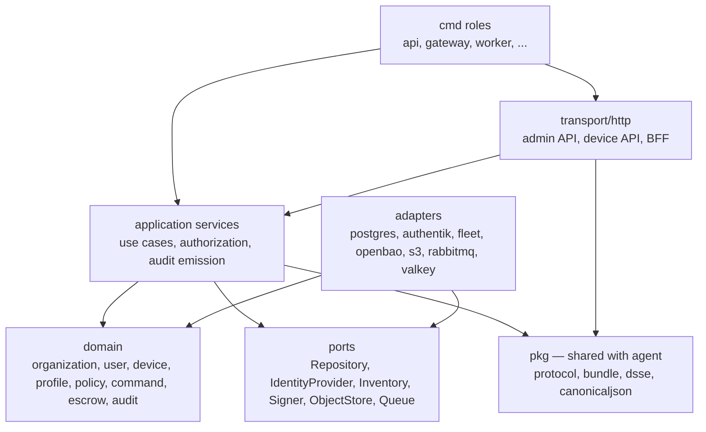

---

## 4. Deployment topology

### 4.1 Docker Compose (v1)

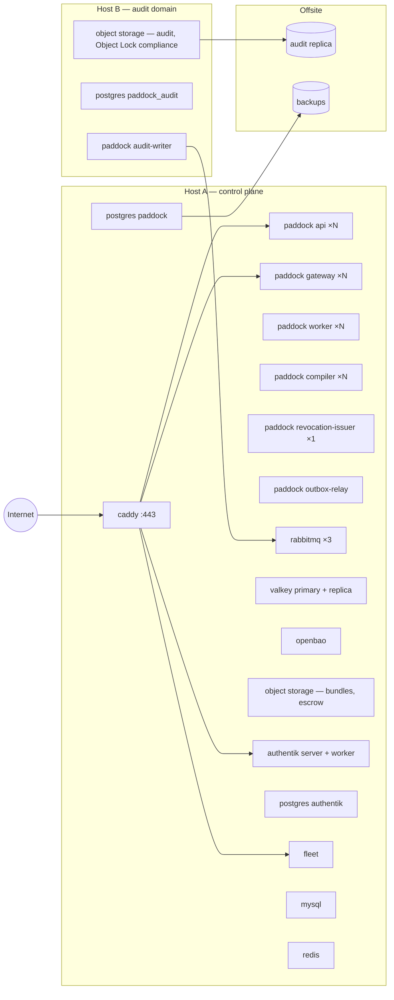

Public hostnames (each its own TLS certificate and rate limit profile):

| Hostname | Target | Exposure |
| --- | --- | --- |
| `device.<domain>` | `gateway` | Internet (devices are mobile, C1) |
| `auth.<domain>` | Authentik | Internet (Himmelblau logins) |
| `fleet.<domain>` | Fleet enroll/osquery endpoints only (`/api/osquery/*`, `/api/fleet/orbit/*`) | Internet |
| `admin.<domain>` | `api` + portal static files | SHOULD be restricted by IP allow list or VPN; MAY be public |
| `bundles.<domain>` | Object storage, presigned GET only | Internet |

Fleet's own UI and admin API are **not** published; Paddock reaches them on the internal network.

**Separation of duties for audit (concept, "Audit log"):** the audit domain runs on a separate host
with separate credentials. The control-plane host holds only a RabbitMQ credential that can **publish**
to exchange `paddock.audit` and, for the portal's audit view, a **read-only** database role on the audit index
(`paddock_audit_reader`: `SELECT` only, RLS by organization). It holds no write or delete credential for
the audit database and no credential at all for the audit bucket.

### 4.2 Kubernetes later

The roles are stateless 12-factor processes configured by environment variables, with health and
readiness endpoints (§19). A Helm chart is a non-goal for v1, but nothing in v1 may rely on
Compose-only features (shared volumes between roles, `depends_on` ordering for correctness, host networking).

---

## 5. Organization isolation

Principle 5 requires isolation "in one layer, not in each query". That layer is **PostgreSQL
Row-Level Security**, activated by one function in the repository layer.

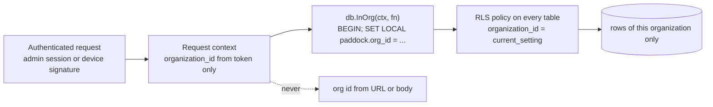

Binding rules:

1. Every table except `organization` and global reference tables has `organization_id uuid NOT NULL`
   and an RLS policy `USING (organization_id = current_setting('paddock.org_id')::uuid)` plus the same
   `WITH CHECK`. `current_setting` without `missing_ok` raises an error when the setting is absent, so
   a forgotten context **fails closed**.
2. Application roles (`paddock_api`, `paddock_gateway`, `paddock_worker`, `paddock_compiler`,
   `paddock_revocation`) are `NOBYPASSRLS` and not table owners. Migrations run as `paddock_owner`.
3. The only cross-organization access is `paddock_scheduler` (read-only on `organization` and on the
   job tables) which enumerates organizations and then opens one `InOrg` transaction per organization.
4. The organization ID comes **only** from the authenticated principal: the admin session or the
   device identity. Admin API paths do not contain an organization ID.
5. A row hidden by RLS is indistinguishable from a missing row; handlers map both to **404**.
6. Object storage keys start with `org/<organization_id>/`; presigned URLs are created only from
   keys built by the server from the authenticated principal.
7. RabbitMQ routing keys carry the organization: `ingest.<kind>.<org>`, `state.changed.<org>`, `audit.<source>.<org>`;
   Valkey keys of organization data are prefixed with the organization or the device ID (§8.3).
8. Authentik and Fleet are not organization-aware in the same way; their isolation is enforced by
   the adapters (§9.2, §15).

The automated **negative isolation test** (§22) walks all OpenAPI operations with a principal of
organization A and IDs of organization B and requires 404 for every one.

---

## 6. Device identity and the agent–server protocol

### 6.1 Why not mTLS, why not Authentik

| Option | Pro | Con |
| --- | --- | --- |
| mTLS with device certificates | Standard, strong | Breaks behind TLS-intercepting corporate proxies (C1 "works through restrictive proxies"); TLS terminates at the proxy, so identity must be forwarded in headers anyway |
| OAuth client credentials in Authentik per device | One identity system | Authentik is not built for 10⁵ machine clients with TPM-bound keys, clone detection and 5-minute token traffic; couples device fetches to IdP availability |
| **Per-request signatures with a device key** (chosen) | Survives TLS interception; end-to-end; key can live in the TPM; stateless verification | Own (small) protocol to specify and test |

Integrity and confidentiality of what matters do not depend on TLS: bundles and commands are
signed end-to-end, secrets in bundles are encrypted to the device's key. TLS protects metadata.

### 6.2 Keys on the device

| Key | Algorithm | Storage | Purpose |
| --- | --- | --- | --- |
| Device signing key | ECDSA P-256 | TPM2 persistent handle (non-exportable) if TPM 2.0 is present, else `/var/lib/paddock/identity/sign.key` (0600 root) | Request signatures, enrollment, key rotation |
| Device encryption key | X25519 (HPKE, RFC 9180) | `/var/lib/paddock/identity/enc.key` (0600 root), sealed to TPM where available | Decrypt per-device secrets in bundles |

The identity record stores whether the signing key is TPM-resident (`key_protection = tpm|file`).
The portal shows it; organizations MAY require `tpm` at enrollment.

### 6.3 Request signature

Every device request carries:

```
Paddock-Device: <device_id>
Paddock-Key-Id: <key_id>
Paddock-Timestamp: <unix seconds>
Paddock-Nonce: <16 random bytes, base64url>
Paddock-Content-SHA256: <base64url sha256 of body, empty body hashed as empty string>
Paddock-Seq: <last sequence number received from server>
Paddock-Signature: <base64url ECDSA P-256 signature over the canonical string>
```

Canonical string (UTF-8, `\n` separated, no trailing newline):

```
paddock-v1
<METHOD>
<path including query, as sent>
<Paddock-Device>
<Paddock-Key-Id>
<Paddock-Timestamp>
<Paddock-Nonce>
<Paddock-Content-SHA256>
<Paddock-Seq>
```

Gateway verification order: header presence → timestamp within ±300 s of server time (else 401
`clock_skew`, response carries server time so the agent can report drift) → key lookup in Valkey
`dk:<key_id>` (cache, filled by worker from PostgreSQL) → key status `active` → signature →
nonce unseen (Valkey `SET nonce:<device>:<nonce> 1 NX EX 600`; checked for all methods) → organization context set from
the device record.

### 6.4 Clone detection (A6)

Each check-in response carries `seq`, a per-device counter incremented by the worker that processes
the check-in. The device stores it and sends it back as `Paddock-Seq`. A cloned disk image runs two
devices with one identity; their sequence values diverge. The worker detects a `Paddock-Seq` that is
older than the last one it issued **and** older than the one before (tolerance of one for a lost
response) and raises `device.clone_suspected` (alert + audit event). The device record moves to
`quarantined`: check-ins are still answered (fail safe), but no new commands or secrets are issued
until an admin resolves it. With a TPM-resident key a clone cannot sign at all and is rejected outright.

Additional fingerprint signals reported at enrollment and on change: `/etc/machine-id`, DMI product
UUID, TPM EK public key hash, root LUKS UUID. A change of any is an audit event; a change of the TPM
EK hash with an unchanged key is a clone or hardware-swap signal.

### 6.5 Identity lifecycle

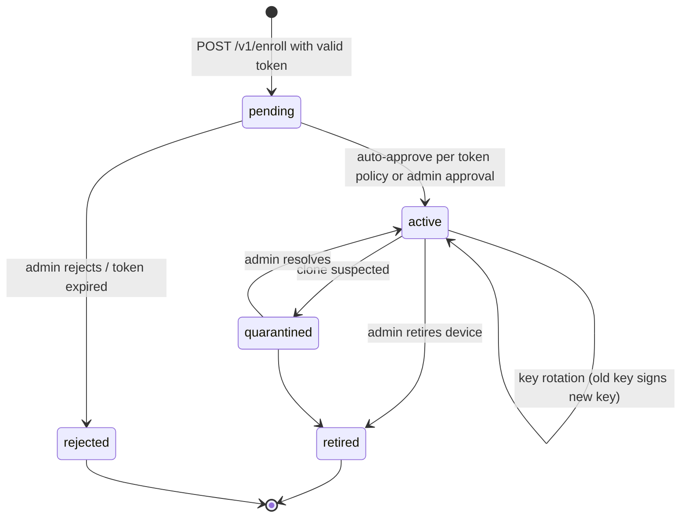

- **Enrollment tokens** are created by an org admin: `organization_id`, `expires_at` (max 30 days),
  `max_uses`, `device_group_id`, `auto_approve bool`, `require_tpm bool`. Stored as SHA-256 hash only.
- **Rotation:** the agent rotates the signing key every 180 days or on command. `POST /v1/identity/rotate`
  is signed with the old key and carries the new public key plus a proof signature with the new key.
  The old key stays valid for 24 h.
- **Revocation of identity:** the device record goes to `retired`, the key to `revoked`. The gateway
  answers 401 `identity_revoked`. The agent stops contacting the server (one attempt per 24 h) and
  **does nothing else** (fail safe). Re-enrollment is required; a device never changes organization.

### 6.6 Enrollment sequence

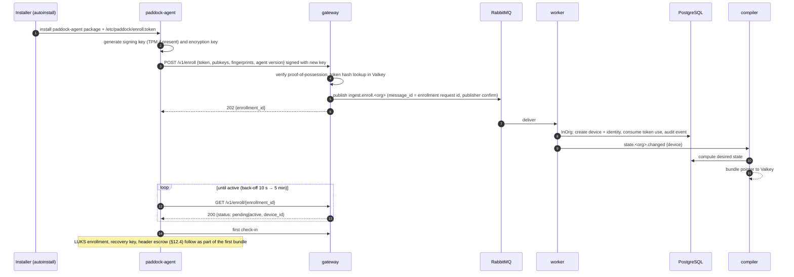

The enrollment request is the only device request signed with a key unknown to the server; the
token is the authorization. Tokens are org-bound, so the device is org-bound from the first byte.

### 6.7 Check-in

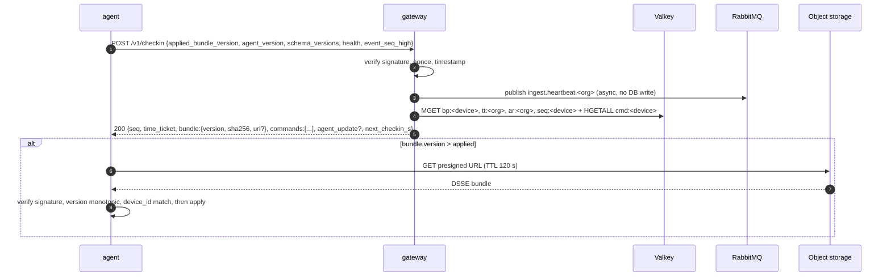

- `url` is only included when the version is newer than the applied one; presigning is a local HMAC
  computation in the gateway and needs no network call.
- The `seq` value in the response is the gateway's prediction (`last_issued + 1`, read from Valkey); the
  worker confirms it when processing the heartbeat. Divergence handling is as in §6.4.
- **Event-triggered check-ins:** besides the timer, the agent checks in immediately (with 0–15 s random delay) when network connectivity becomes available (NetworkManager `Connectivity` = `FULL` via D-Bus, or `systemd-networkd` state change), after resume from suspend (logind `PrepareForSleep(false)`), and at boot. A laptop that comes online therefore receives a pending user lock within seconds, not after up to five minutes. Event-triggered check-ins are rate-limited to one per 60 s.
- `next_checkin_s` = 300 × random(0.8, 1.2). Failure back-off: 30 s, 60 s, 2 min, 5 min, 10 min,
  30 min (cap), each with ±20 % jitter. The server MAY raise `next_checkin_s` under load (backpressure, §8).
- **Proxies:** the agent honours `HTTPS_PROXY`/`NO_PROXY` and a proxy setting in `/etc/paddock/agent.yml`;
  it never alters system routes, DNS or VPN state (open question "third-party VPNs").

### 6.8 Device API

| Method and path | Purpose | Success | Errors |
| --- | --- | --- | --- |
| `POST /v1/enroll` | Enrollment request | 202 | 400 `invalid_request`, 401 `invalid_token`, 409 `already_enrolled`, 429 |
| `GET /v1/enroll/{id}` | Enrollment status | 200 | 404 |
| `POST /v1/checkin` | Heartbeat + desired state pointer + commands | 200 | 401 `clock_skew` / `invalid_signature` / `identity_revoked`, 426 `agent_unsupported`, 429 |
| `POST /v1/events` | Batch of agent events (max 500 or 1 MiB) | 202 | 400, 401, 413, 429 |
| `POST /v1/commands/{command_id}/result` | Command outcome (idempotent per command ID) | 202 | 401, 404, 429 |
| `POST /v1/escrow` | Encrypted secret upload (admin password, LUKS header, recovery key) | 202 `{escrow_id}` | 400, 401, 413, 429 |
| `GET /v1/escrow/{escrow_id}` | Storage confirmation | 200 `{status: pending\|stored\|failed}` | 401, 404 |
| `POST /v1/identity/rotate` | Key rotation | 202 | 400, 401 |
| `GET /v1/agent/artifacts/{version}/{arch}` | 302 to presigned agent artifact | 302 | 401, 404 |

All POST bodies are JSON (`application/json`), events and escrow uploads MAY be `zstd`-compressed
(`Content-Encoding: zstd`). The device API is versioned in the path; see §21.

---

## 7. State compilation and bundle delivery

### 7.1 Flow

```mermaid
flowchart LR
  subgraph inputs[Inputs — PostgreSQL]
    cfg[org config change sets]
    prof[profiles + assignments]
    mem[group memberships<br/>incl. Authentik sync]
    dev[device record, device groups,<br/>login assignment, suspension]
    hold[package holds, update policy]
    rel[agent release + rollout wave]
  end

  inputs -->|same tx: outbox row| ob[outbox-relay]
  ob -->|state.changed.org<br/>scope: org / group / user / device| js[(RabbitMQ<br/>partitioned state queues)]
  js --> comp[compiler]
  comp -->|dependency index:<br/>which devices are affected| set[affected devices]
  set --> render[render desired state per device<br/>canonical JSON, RFC 8785]
  render --> hash{content hash<br/>unchanged?}
  hash -->|yes| skip[no new version]
  hash -->|no| sign[sign via OpenBao Transit<br/>batch, Ed25519]
  sign --> put[put org/ORG/devices/DEV/bundles/VERSION.dsse]
  put --> ptr[bundle row in PostgreSQL<br/>then SET bp:DEV in Valkey]
```

- **Recompute on change, never per request.** The compiler consumes `state.changed.<org>` with a
  scope. Scopes are expanded to devices with the dependency index (user → devices whose login
  assignment contains the user; group → its members' devices; profile → assignments → users →
  devices; org → all devices of the org).
- **Coalescing:** the compiler debounces per device for 2 s, so a bulk import produces one version.
- **Monotonic versions:** `bundle.version` is a per-device `bigint` sequence (`device.bundle_seq`),
  incremented in the same transaction that records the bundle row. Content-equal renders do not
  increment.
- **Signing throughput:** OpenBao Transit `sign` with `batch_input` (up to 1 000 items per call).
- **Ordering:** state events are routed to 16 partition queues by `hash(organization_id) mod 16`
  (computed by the publisher, plain direct exchange — no plugin); each partition queue has
  *single active consumer* enabled, so one organization is compiled by one consumer at a time while up
  to 16 compiler replicas share the load. A Valkey lock `lock:compile:<device>` (`SET NX PX 30000`)
  guards the manual recompile path.

### 7.2 Bundle format

The envelope is **DSSE** (Dead Simple Signing Envelope, Apache-2.0 specification), payload type
`application/vnd.paddock.bundle.v1+json`. The payload is canonical JSON (RFC 8785).

```json
{
  "schema_version": 1,
  "bundle_version": 4182,
  "device_id": "0b6d4c8e-6c55-4a5e-9a2f-1f7f0f5b4a11",
  "organization_id": "5c1e6d2a-7f0e-4b0d-8f8b-0a3b9b1e2c33",
  "issued_at": "2026-10-03T08:15:00Z",
  "min_agent_version": "1.0.0",
  "agent": { "checkin_interval_s": 300 },
  "login": {
    "suspended": false,
    "locked_users": ["bob@example.org"],
    "provider": "himmelblau",
    "allow_groups": ["paddock:acme:g:engineering"],
    "allow_users": [],
    "himmelblau_conf": { "content_sha256": "…", "content": "…" }
  },
  "sudo": {
    "files": [
      { "name": "paddock-u-3f9a1c0b7d2e4a55", "user": "alice@example.org", "content": "…", "sha256": "…" }
    ],
    "lecture": "…"
  },
  "local_admin": { "username": "paddock-admin", "rotation_interval_days": 30 },
  "updates": {
    "security_daily_at": "03:00",
    "regular_schedule": "Sat 04:00",
    "holds": [ { "package": "linux-image-generic", "version": null } ]
  },
  "protected": { "paths": ["/etc/sudoers", "/etc/sudoers.d/", "/etc/himmelblau/", "/etc/pam.d/", "/etc/nsswitch.conf"] },
  "dead_mans_switch": { "enabled": false },
  "resources": [
    { "id": "file:/etc/apt/apt.conf.d/50paddock", "type": "file", "mode": "0644", "owner": "root", "content": "…" }
  ],
  "secrets": [
    { "id": "…", "hpke_enc": "…", "ciphertext": "…" }
  ],
  "keys": {
    "escrow_wrap_public": "…",
    "command_signing": ["…"],
    "revocation_signing": ["…"]
  }
}
```

Agent verification, in this order — any failure rejects the bundle, keeps the current state, and
reports `bundle.rejected` with a reason code:

1. DSSE signature valid against a key in the agent's trust store (`bundle-signing` public keys; the
   trust store is delivered in the agent package and updated only via signed bundles that are signed by a currently trusted key).
2. `device_id` and `organization_id` equal the enrolled identity.
3. `bundle_version` > last applied version (persisted in `/var/lib/paddock/state/applied.json`).
4. `schema_version` supported by this agent.
5. `sha256` of the downloaded object equals the value from the check-in response.

### 7.3 Edge caching with preserved authorization

Bundles are served only through presigned GET URLs (TTL 120 s) whose key contains organization,
device and version. A CDN MAY cache by full URL including the signature query; one device's URL is
never valid for another key. Because bundles are versioned and immutable, objects are written once
with `Cache-Control: private, max-age=120`.

---

## 8. Asynchronous ingest

### 8.1 RabbitMQ topology

Only core RabbitMQ features are used: topic/direct exchanges, **quorum queues**, publisher confirms,
dead-lettering, delivery limits, single active consumer. **No plugins** (no consistent-hash exchange, no
streams, no delayed-message plugin), so the topology runs unchanged on Amazon MQ for RabbitMQ.

| Exchange (type) | Routing key | Queue(s) (quorum, durable) | Limits | Consumer |
| --- | --- | --- | --- | --- |
| `paddock.ingest` (topic) | `ingest.<kind>.<org>`, kind ∈ heartbeat, event, result, escrow, enroll | `ingest.<kind>` (one per kind) | `x-max-length-bytes` per queue, `x-overflow: reject-publish`, `x-delivery-limit: 20` | `worker` (competing consumers, prefetch 100) |
| `paddock.state` (direct) | `p00` … `p15` = `hash(org) mod 16`; `priority` for user lock/unlock | `state.p00` … `state.p15`, `state.priority` | `x-single-active-consumer: true` | `compiler` |
| `paddock.audit` (topic) | `audit.<source>.<org>` | `audit.writer` | `x-overflow: reject-publish`, **no TTL** (audit events are never dropped) | `audit-writer` |
| `paddock.external` (topic) | `external.authentik.<org>`, `external.fleet` | `external.authentik`, `external.fleet` | delivery limit 20 | `worker` |
| `paddock.revocation` (direct) | `approved` | `revocation.approved` | single active consumer | `revocation-issuer` |
| `paddock.dlx` (topic) | original routing key | `dlq.<queue>` | – | none; alert on depth > 0 |

Delayed retries are implemented without the delayed-message plugin: the consumer rejects without
requeue → dead-letter to `retry.<queue>` (`x-message-ttl` 5000 ms, dead-letter exchange back to the
source exchange) → redelivered after 5 s. Poison messages end in `dlq.<queue>` after 20 deliveries.

### 8.2 Guarantees

- **At-least-once:** publishers use publisher confirms and treat a missing or negative confirm as
  failure; consumers ack after their database transaction commits.
- **Idempotency:** RabbitMQ has no broker-side deduplication. Every message carries the AMQP
  `message_id` (the natural key) and every consumer writes with that natural key
  (`(device_id, event_seq)`, `command_id`, `escrow_id`, `enrollment_id`, audit `event_id`) and
  `ON CONFLICT DO NOTHING`. Duplicates are therefore harmless by construction.
- **Poison messages:** a DLQ depth > 0 raises an alert; audit messages in a DLQ are a **critical** alert.
- **Backpressure:** when an ingest queue reaches its byte limit, RabbitMQ rejects the publish
  (negative confirm); the gateway answers 429 + `Retry-After` and the agent keeps the data in its
  local spool (§11.5). Independently, the gateway reads queue depths (passive `queue.declare`, cached
  10 s) and raises `next_checkin_s` up to 900 s when a queue exceeds 70 % of its limit.
- **Ordering** is only guaranteed where it matters (state compilation per organization, §7.1);
  ingest consumers do not rely on order (event sequence numbers are explicit).
- **Heartbeats:** the `last_contact` materialization is coalesced: the worker writes
  `device_status.last_contact_at` at most once per 60 s per device.
- **No synchronous device → database path:** the `gateway` database role has no grants on any table.

### 8.3 Valkey

Valkey (BSD-3-Clause) is a **cache and coordination store, never a source of truth**: everything
except nonces can be rebuilt from PostgreSQL (`paddockctl admin rebuild-cache`). Only core commands
are used (strings, hashes, `SET NX EX/PX`, `MGET`, `EXPIRE`), no modules, so ElastiCache for Valkey
is a drop-in target.

| Key | Type | Written by | Read by | TTL |
| --- | --- | --- | --- | --- |
| `dk:<key_id>` | hash (device_id, org, status, public key) | worker | gateway | none |
| `nonce:<device_id>:<nonce>` | string | gateway (`SET NX EX 600`) | gateway | 600 s |
| `bp:<device_id>` | string (version, sha256, object key) | compiler | gateway | none |
| `cmd:<device_id>` | hash command_id → signed envelope | worker, revocation-issuer | gateway | expired fields removed by a cleanup job |
| `tt:<org>` | string (signed time ticket) | compiler | gateway | 30 min |
| `ar:<org>` | string (rollout state) | worker | gateway | none |
| `seq:<device_id>` | string counter | worker | gateway | none |
| `et:<token_hash>` | hash (enrollment token: org, status, uses) | worker | gateway | token expiry |
| `lock:compile:<device_id>`, `lock:<job>` | string | compiler, scheduler | – | 30 s |

Deployment: one primary + one replica with Sentinel in production; AOF `everysec`. Loss of Valkey
stops check-ins until it is back and rebuilt (devices keep working, C2); loss of nonces only reopens
the ±300 s replay window for that period, and replayed requests are idempotent anyway.

---

## 9. Identity, users, and login

### 9.1 Responsibilities

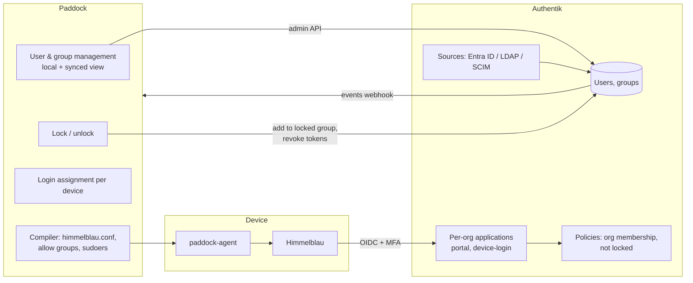

### 9.2 Mapping Paddock organizations to Authentik (A1)

| Option | Pro | Con |
| --- | --- | --- |
| **One shared Authentik, one application + group tree per organization** (chosen) | One component to patch and back up; scales operationally; uses only open-source features | Isolation enforced by Paddock-managed policies; an Authentik superuser sees all organizations |
| One Authentik per organization | Hard isolation | Operations scale linearly; rejected by the concept for Fleet for the same reason |
| Authentik's enterprise multi-tenancy | Built-in separation | Not part of the open-source core (concept: "only Authentik's open-source core") |

Per Paddock organization, the `authentik` adapter creates and owns (idempotently, reconciled every 10 min):

| Authentik object | Name | Purpose |
| --- | --- | --- |
| Group | `paddock:<org_slug>` | Root group; every user of the organization is a member |
| Group | `paddock:<org_slug>:locked` | Membership = locked |
| Group | `paddock:<org_slug>:admins` (+ `:operators`, `:auditors`) | Portal roles |
| Group | `paddock:<org_slug>:g:<group_slug>` | Local Paddock groups |
| OIDC provider + application | `paddock-device-<org_slug>` | Himmelblau login; refresh tokens enabled (PoC item 4) |
| Policy binding (expression) | on the device application | allow iff member of `paddock:<org_slug>` **and not** member of `:locked` |
| Authentication flow | `paddock-<org_slug>-login` | Identification stage with user enumeration prevention, MFA stage; upstream sources for this org only |

The portal uses one shared OIDC application `paddock-portal`; its policy admits only members of
any `paddock:*:admins|operators|auditors` group. Paddock derives the organization of an admin from
exactly one such group; an account in admin groups of two organizations is rejected at login (no
cross-organization roles, concept scope).

**Usernames** are globally unique in Authentik. Paddock enforces `local-part@<org verified domain>`
for local users; synced users keep their upstream UPN. Paddock refuses a user whose name collides
with a user of another organization (409 `username_taken`, without revealing the other organization).

**Lock (F2).** Lock = add to `:locked` + revoke the user's sessions and refresh tokens in Authentik
via API. Using a group instead of `is_active=false` keeps the lock effective even when an upstream
source sync rewrites user attributes. Unlock removes the membership.

**Synced objects (F13).** Upstream-owned attributes (name, email, password, upstream group
membership) are read-only; Paddock-owned attributes (lock state, Paddock groups, profile
assignments, login assignments) are writable for all users.

**Groups (open point in the concept).** Both: local groups are managed in Paddock; synced groups
are imported read-only and can be targets of profile and login assignments.

### 9.3 Himmelblau configuration

Paddock renders `himmelblau.conf` from the organization's login settings: OIDC issuer and client
of `paddock-device-<org_slug>`, allowed groups, Hello PIN on/off, offline emergency access (default
off, portal warning when enabled). Himmelblau runs in OIDC mode only (concept decision). The exact
option names are fixed after the PoC (A2) in the schema file `server/internal/compiler/himmelblau/schema.go`.

**Fallback (PoC fails):** SSSD with the OIDC/IdP provider against Authentik, offline credentials
cache in days. The bundle field `login` gets a `provider: himmelblau|sssd` discriminator from the start
so the fallback does not change the bundle schema version.

### 9.4 Login assignment and suspension (F15)

Each device has a **login assignment** (users and/or groups). The compiler turns it into the
login component's allow list: `login.allow_groups` holds the Authentik group identifiers of the
assigned groups, `login.allow_users` the identifiers of directly assigned users. Whether Himmelblau
accepts user entries next to groups, or whether Paddock instead maintains one Authentik group
`paddock:<org_slug>:dev:<device_id>` per device, is fixed by PoC item 3; the bundle schema carries
both fields from the start.

- **Suspend:** `login.suspended = true` → allow list empty; the agent terminates directory-user
  sessions with `loginctl terminate-user` for every session whose user is not a local system user.
- The managed local admin authenticates through `pam_unix` and is unaffected.
- Shared devices: assign a group. Audit attribution uses the logged-in user reported by the agent
  (`session.login` events contain only the username and time — no process or command data).

### 9.5 User lock on the device (F2)

A lock in Paddock acts on **two independent paths**; neither waits for the other.

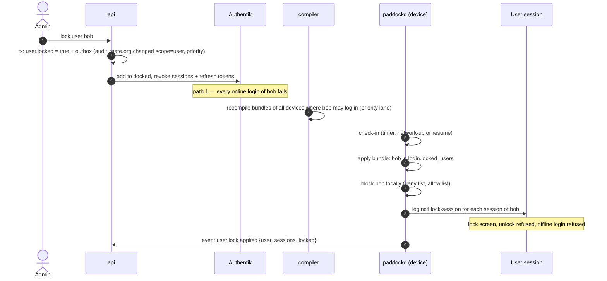

**Affected devices** = devices whose login assignment contains the user (directly or via a group)
**plus** devices on which the agent has reported a session of the user in the last 365 days
(`device_user_seen`, fed by `session.login` events). This covers cached credentials on devices the
user is no longer assigned to.

**Priority lane:** user-lock and unlock changes are published as `state.changed.<org>` with
`priority=high`; the compiler consumes them from a separate consumer before other work, without the
2 s debounce. Target: bundle available ≤ 10 s after the admin action.

**Local enforcement on the device** — configuration only, no custom PAM code (concept rule 1):

1. The user is removed from the login component's allow list (`login.allow_users`/groups rendering).
2. The user is written to `/etc/paddock/login-deny` (one username per line, protected area).
   Whether step 2 is needed depends on the PoC (item 5 below): if Himmelblau's allow list is enforced
   **offline and at screen unlock**, step 1 suffices and step 2 is not rendered. Otherwise Paddock
   adds the standard Linux-PAM module `pam_listfile` to the `account` phase of `common-account`:
   `account required pam_listfile.so item=user sense=deny file=/etc/paddock/login-deny onerr=succeed`.
   `onerr=succeed` keeps logins working if the file is missing (fail safe).
3. Active sessions: `loginctl lock-session <id>` for every session of the user → the desktop shows
   the lock screen; unlock runs through PAM and is refused by step 1/2. Per organization setting
   `user_lock_session_action: lock_screen | terminate` (default `lock_screen`); `terminate` uses
   `loginctl terminate-user` and loses unsaved work.
4. The lock persists locally while the device is offline. It is lifted only by a newer signed bundle.

**The agent runs before anyone logs in.** `paddock-supervisor.service` is `WantedBy=multi-user.target`
and has **no** dependency on `network-online.target`, so it starts at boot, runs at the login screen,
and works in the background regardless of user sessions. Locks, unlocks, configuration and commands
are applied as soon as a check-in succeeds.

**Lock propagation (replaces the concept table):**

| Situation | Behaviour |
| --- | --- |
| Device online, user locked | Session locked, login refused at the next check-in (≤ 6 min, usually seconds after a network or resume event); online authentication fails immediately through Authentik |
| Device offline at the time of the lock | Offline login with cached credentials remains possible **until the device's next contact** |
| Device comes online | Event-triggered check-in → lock applied within seconds |
| Exposure must end even without contact | Not possible on a device that never connects; dead man's switch (F14) and encryption are the remaining controls |
| Unlock | Allow list restored at the next check-in; online login works again once Authentik membership is removed |

**PoC gate extension (A2, item 5):** on Ubuntu 26.04 with GNOME/GDM, verify that (a) Himmelblau's
allow list refuses an offline login with cached credentials, (b) GNOME screen unlock of an existing
session is refused for a user removed from the allow list, (c) the same with `pam_listfile`
if (a) or (b) fails. The result decides whether step 2 is rendered.

### 9.6 Admin authentication and step-up

- Portal login: OIDC authorization code + PKCE against `paddock-portal`, handled by the `api` role as
  BFF. The browser holds only an encrypted, HttpOnly, `SameSite=Strict` session cookie (AES-256-GCM,
  key from OpenBao KV loaded at start, rotated monthly with one previous key accepted). Session
  lifetime 8 h, idle 30 min.
- **Step-up** for reveal, Lock, Destroy, approvals, profile class changes to Full: a new
  authorization request with `prompt=login`, `max_age=0` and the Authentik flow
  `paddock-stepup` (WebAuthn required). The resulting ID token (`auth_time` ≤ 300 s old) is
  attached to the action and stored with it (§14.3, ADR 0014).

| Portal role | May |
| --- | --- |
| `org_admin` | Everything in the organization, including reveal, Lock, Destroy approval |
| `org_operator` | Devices, users, profiles, commands except reveal, Lock, Destroy |
| `org_auditor` | Read-only, including audit log and evidence export |
| `platform_admin` | Create organizations, manage releases; **no** access to organization data |

---

## 10. Permission profiles and sudo

### 10.1 Ownership (A13)

**Paddock alone determines sudo rights.** Himmelblau and SSSD are configured to grant no sudo and
to map no directory group onto a local sudo-granting group. The agent's `sudo` reconciler enforces:

- `/etc/sudoers` equals the distribution default plus `@includedir /etc/sudoers.d`, checksum-protected.
- Members of `sudo`, `admin`, `wheel` are exactly `{paddock-admin}`; any other member is removed
  (drift correction, F1) and reported as `tamper.sudo_group_member` with the username.
- `/etc/sudoers.d/` contains only `README`, Paddock-generated files, and files from packages listed
  in an allow list in the bundle; any other file is moved to `/var/lib/paddock/quarantine/` and reported.

**A user in a sudo-granting group without a Paddock profile** is therefore removed from the group at
the next apply and receives exactly the effective profile (possibly None). The portal shows the
finding on the device and the user.

### 10.2 Effective profile

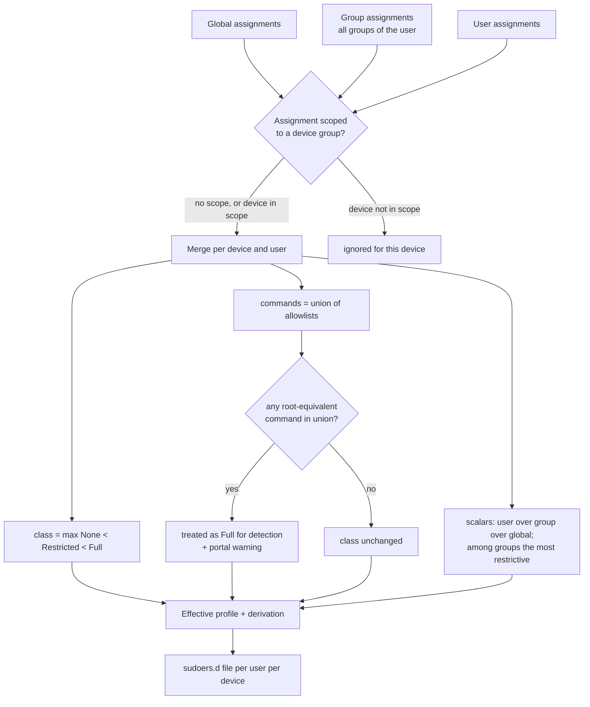

- **Device-group scope (decided):** `profile_assignment.device_group_id` (nullable). An assignment
  with a scope applies only on devices in that group. The effective profile is therefore computed per
  `(user, device)`; the compiler caches it per `(user, set of device groups of the device)`.
- **Root-equivalent catalog:** `server/internal/domain/profile/rootequiv.go` holds a versioned list
  (package managers, `systemctl edit`, `docker`, editors/pagers with shell escape, interpreters,
  `chmod`/`chown` on arbitrary paths, `tee`, `cp`, `mv`, `dd`, `mount`, `insmod`, …). A command entry
  matches by absolute binary path; wildcard arguments on a catalog binary count as root-equivalent.
- **Scalars:** `require_password bool` (most restrictive: `true`), `timestamp_timeout_min int`
  (most restrictive: lowest), `lecture always|once|never` (most restrictive: `always`).
- **Determinism:** inputs are sorted (commands lexicographically, users by ID) before rendering; the
  acceptance gate requires byte-identical output for permuted inputs (property test, §22).

### 10.3 Generated sudoers file

File name `paddock-u-<first 16 hex chars of sha256(username)>`. sudo ignores files in `includedir`
whose names contain `.` or end in `~`; usernames such as `alice@example.org` therefore never appear
in file names. Content:

```
# Managed by Paddock. Do not edit. Bundle 4182, profile digest 9c1f…
Defaults:"alice@example.org" lecture=always, lecture_file=/etc/paddock/sudo_lecture, timestamp_timeout=5
"alice@example.org" ALL=(root) /usr/bin/systemctl restart nginx.service, /usr/bin/journalctl
```

Apply procedure on the device:

1. Copy the current file to `/var/lib/paddock/rollback/`.
2. Write the new content to `/etc/sudoers.d/.paddock-tmp-<random>` (ignored by sudo because of the dot), `fsync`.
3. `visudo -c -f <tmp>`; on failure delete the temp file, report `sudo.apply_failed`, stop.
4. `rename(2)` into place (atomic).
5. `visudo -c` over the whole configuration; on failure restore the rollback copy with `rename(2)`
   and report `sudo.apply_failed`. The compiler also runs `visudo -c` on the rendered content in a sandbox
container before signing (defence in depth).

---

## 11. The agent

### 11.1 Processes and files

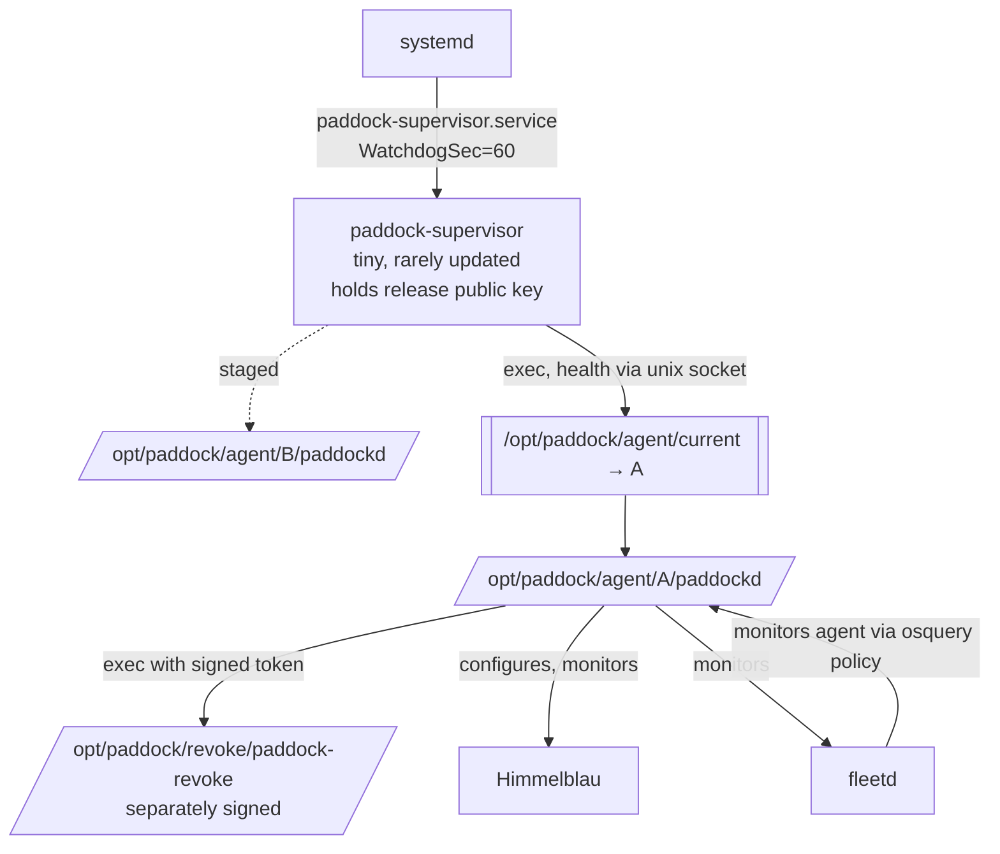

| Path | Content |
| --- | --- |
| `/opt/paddock/supervisor/paddock-supervisor` | supervisor binary (from Debian package `paddock-supervisor`) |
| `/opt/paddock/agent/{A,B}/paddockd` | agent versions; `current` symlink |
| `/opt/paddock/revoke/paddock-revoke` | revocation module (package `paddock-revoke`) |
| `/etc/paddock/agent.yml` | server URL, proxy; protected |
| `/var/lib/paddock/identity/` | keys (0700 root) |
| `/var/lib/paddock/state/` | applied bundle version, `seq`, dead-man's-switch counters |
| `/var/lib/paddock/spool/` | outgoing events (bounded 50 MiB, oldest non-tamper events dropped first, drop is itself an event) |

Everything is Go, `CGO_ENABLED=0`, statically linked, `linux/amd64` and `linux/arm64`.

### 11.2 Update with A/B, self-test, watchdog (design contract 1–6)

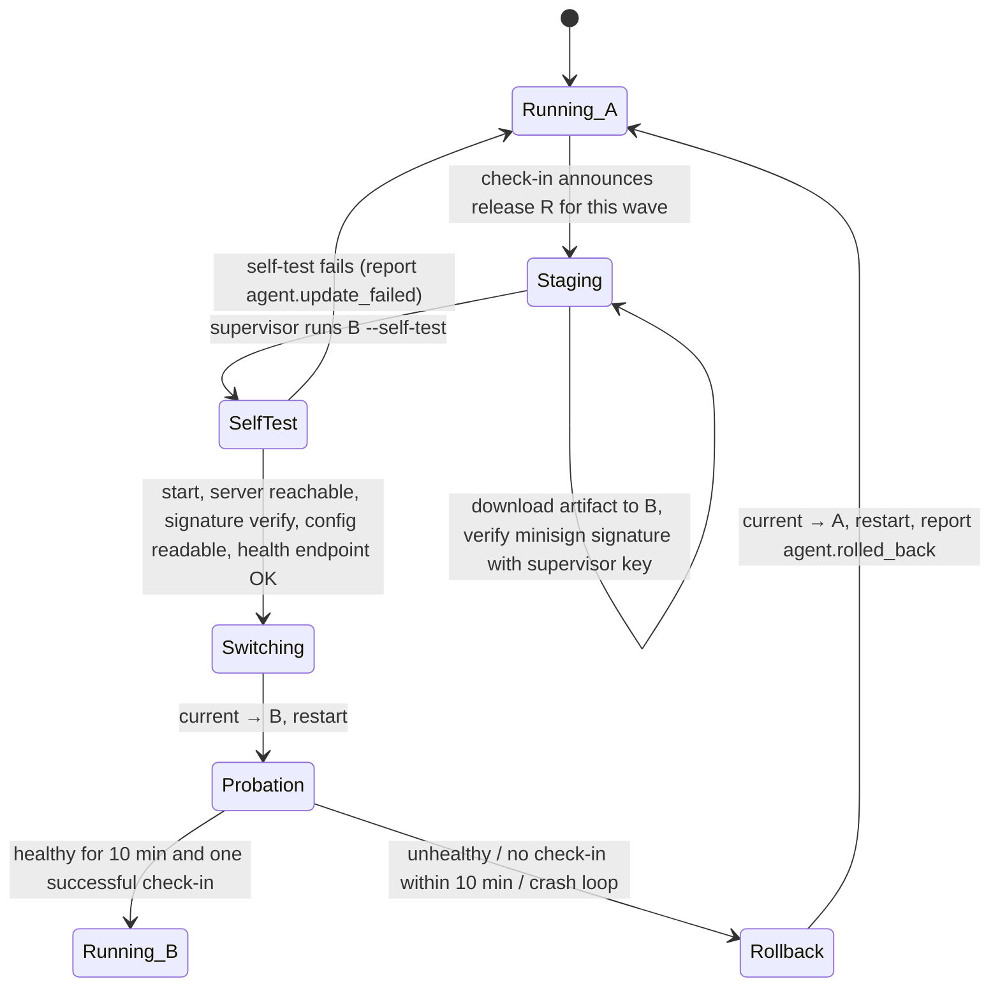

- Self-test runs B in `--self-test` mode with a timeout of 120 s; it must not apply state.
- "Server reachable" in the self-test accepts an unreachable server as **inconclusive**, not failed;
  the switch is then deferred until a check-in succeeds (fail safe: an offline laptop never rolls forward blind).
- **Staged rollout:** waves are percentages of the organization's devices by `hash(device_id) mod 100`:
  1 % → 10 % → 50 % → 100 %, minimum 24 h per wave. The worker stops a release automatically when
  `rolled_back + update_failed > 2 %` of the wave or > 3 devices, whichever is larger, and alerts.
- The supervisor's own update happens only through the distribution package (`apt`), never through the agent channel.

### 11.3 Reconcilers (apply engine)

Fixed resource types, each idempotent, each with `Plan()` (diff without changes) and `Apply()`:

| Type | Manages |
| --- | --- |
| `file` | content, mode, owner of files below an allow-listed prefix set |
| `sudo` | §10 |
| `login` | Himmelblau (or SSSD) config, allow lists, suspension, session termination |
| `local_admin` | account existence, groups, password rotation (§12.2) |
| `apt_hold` | `apt-mark hold/unhold`, `/etc/apt/preferences.d/paddock` for version pins, `Unattended-Upgrade::Package-Blacklist` |
| `updates` | `unattended-upgrades` config for daily security updates; systemd timer `paddock-updates.timer` for regular upgrades |
| `systemd_unit` | enable/active state of listed units (agent, fleetd, log shipper, Himmelblau, time sync) |
| `luks` | keyslot policy, TPM2+PIN enrollment, recovery key, header escrow (§12.4) |
| `time` | NTP enabled (`systemd-timesyncd` or `chrony`), drift report |
| `playbook` (optional) | runs a signed Ansible playbook archive with the locally installed `ansible-core`; disabled unless the organization enables it |

Apply order: `time` → `systemd_unit` → `file` → `apt_hold` → `updates` → `local_admin` → `sudo` →
`login` → `luks` → `playbook` → **re-verify protected areas** (so a playbook cannot silently change
them; any change it made is reverted and reported as `config.playbook_touched_protected`).

### 11.4 Commands

Commands are delivered in the check-in response, signed individually (DSSE,
`application/vnd.paddock.command.v1+json`) by the `command-signing` key, revocation commands by the
`revocation-signing` key.

```json
{
  "command_id": "e3b0…",
  "device_id": "0b6d…",
  "organization_id": "5c1e…",
  "type": "install_now",
  "params": { "packages": ["openssl"] },
  "issued_at": "2026-10-03T08:00:00Z",
  "expires_at": "2026-10-04T08:00:00Z"
}
```

| Type | Default TTL | Idempotency |
| --- | --- | --- |
| `install_now` | 24 h | by `command_id`; re-delivery returns stored result |
| `rotate_admin_password` | 7 d | by `command_id` |
| `escrow_luks_header` | 7 d | by `command_id` |
| `collect_status` | 1 h | by `command_id` |
| `lock` | 30 d | by `command_id`; device-bound token |
| `destroy` | 30 d | by `command_id`; device-bound token |

Expired commands are marked `expired` and never executed (platform outage question). Results go to
`POST /v1/commands/{id}/result`; the agent stores executed command IDs for 60 days to drop duplicates.

### 11.5 Events and detection (layer 3)

| Check | Interval | Event on deviation |
| --- | --- | --- |
| Hash of protected files (inotify + full rescan) | inotify immediate, rescan 5 min | `tamper.protected_file_changed` |
| Units active: `paddockd`, `paddock-supervisor`, `fleetd`, log shipper, Himmelblau | 60 s | `tamper.service_stopped` |
| LUKS keyslot inventory (`cryptsetup luksDump --dump-json-metadata`) | 5 min | `tamper.keyslot_changed` |
| Himmelblau version and config hash | 5 min | `tamper.login_component_changed` |
| Members of sudo-granting groups | 5 min | `tamper.sudo_group_member` |
| Clock offset vs. server time (from check-in) | each check-in | `policy.clock_drift` (> 60 s) |
| Local admin login (journal, `pam_unix` for `paddock-admin`) | journal follow | `local_admin.login` |

Every event carries `event_seq` (per device, monotonic, persisted). The worker reports gaps as
`audit.event_gap` with the missing range. Event types form a closed enum; the gateway rejects unknown
types (N5). **Mutual watch:** an osquery policy in Fleet checks that `paddockd` runs and its binary hash
matches the release manifest; the agent checks that `fleetd` runs. Disabling one is reported by the other.

### 11.6 Protected areas (from the concept)

1. `/etc/sudoers`, `/etc/sudoers.d/`, all files of `file` resources
2. LUKS keyslots and header
3. `/opt/paddock/`, `/etc/paddock/`, systemd units of agent, supervisor, fleetd, log shipper, update timer
4. `/etc/himmelblau/`, `/etc/pam.d/`, `/etc/nsswitch.conf`, `/etc/security/`, Himmelblau packages

---

## 12. Device controls

### 12.1 Last contact and staleness (F12)

The worker materializes `device_status` (`last_contact_at`, `applied_bundle_version`, `agent_version`,
`policy_status`) from heartbeats. A scheduler job (every 5 min, per organization) compares against
`organization_settings.staleness_warning_h` (default 24) and `staleness_critical_h` (default 168).
Crossing a level creates an alert and an audit event; returning resets it with an event.
Silent disappearance rule (open question): a device crossing *critical* gets the status `presumed_lost`
and appears on the "action required" list; the admin chooses Retire, Lock or Keep.

### 12.2 Managed local administrator (F16)

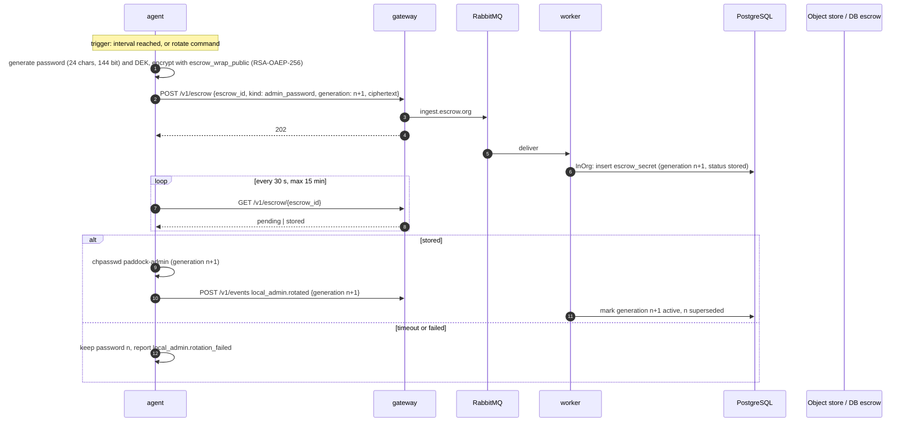

- The server keeps **both** generations n and n+1 until the device confirms the switch; a reveal
  during that window shows both with their state, so no password is ever unknown.
- Reveal: step-up required → `api` asks OpenBao Transit `decrypt` on key `escrow-wrap` through the
  `escrow-reader` policy (only reachable from `api` with a step-up proof) → plaintext is shown once,
  never logged; audit event `local_admin.revealed`. Organization policy `rotate_after_reveal_h` (default
  off) issues `rotate_admin_password` automatically.

### 12.3 Revocation: Lock and Destroy (F5)

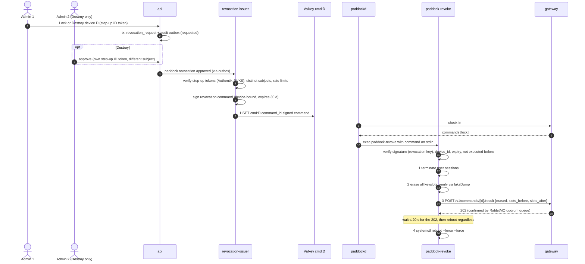

- The confirmation is accepted as delivered when the RabbitMQ quorum queue has confirmed it (202 is
  returned only after the publisher confirm, i.e. after a majority of nodes persisted it). That is the bound the concept requires; DB materialization follows.
- **Destroy** additionally deletes the escrowed header object and its wrapped DEK server-side, and records both approvals.
- Header escrow before need: §12.4.
- `paddock-revoke` is its own package, signed with the **revocation release key** (separate from the agent
  release key), and its code is under CODEOWNERS two-person review (concept design contract 7, 10).
- Server-side auto-destroy policy: locked devices not recovered within `auto_destroy_after_days`
  (default off) get a Destroy that requires the two approvals at the time the policy is enabled, recorded with the policy change.

### 12.4 Disk encryption and escrow

At first apply (`luks` reconciler, once per device and after every keyslot change):

1. Verify root volume is LUKS2; otherwise report `luks.not_encrypted` (device marked non-compliant; nothing else happens).
2. Generate recovery key (systemd-cryptenroll `--recovery-key` format, 256 bit) and enroll it.
3. Enroll TPM2 + PIN (`systemd-cryptenroll --tpm2-device=auto --tpm2-with-pin=yes --tpm2-pcrs=7`)
   — the PIN is entered by the user during first-boot onboarding (A14 open, §25).
4. Escrow: header backup (`cryptsetup luksHeaderBackup`), encrypted with a random DEK (AES-256-GCM);
   DEK and recovery key wrapped with `escrow_wrap_public`; uploaded via `/v1/escrow`; wait for `stored`.
5. Only after `stored`: remove remaining low-entropy keyslots (installer passphrase), escrow the
   header again, wait for `stored`.
6. Expected keyslot set (`tpm2`, `recovery`) recorded in state; any other change is `tamper.keyslot_changed`.

Escrow objects live in a separate bucket `paddock-escrow` (versioning on, **no** Object Lock, so Destroy
can delete them), keys `org/<org>/devices/<dev>/luks-header/<generation>.bin`.

### 12.5 Patch management (F6)

- Daily security updates: `unattended-upgrades` with `Unattended-Upgrade::Allowed-Origins` limited
  to `${distro_id}:${distro_codename}-security`, blacklist from holds, run at `security_daily_at` with
  60 min random delay.
- Regular updates: `paddock-updates.timer` → `paddockd updates run` → `apt-get update && apt-get -y
  -o Dpkg::Options::=--force-confold dist-upgrade`, honouring holds; result reported as `updates.run`.
- Holds: `apt-mark hold` (no version) or an `apt_preferences` pin (`Pin-Priority: 1001` to a version).
- Immediate install: command `install_now`; holds win over immediate install for the same package
  (the API returns 409 `package_on_hold`).
- Reboot required: reported (`updates.reboot_required`); Paddock never reboots for updates in v1.

### 12.6 Dead man's switch (F14)

- Contact anchor: every check-in response carries a **time ticket** `{organization_id, issued_at}`
  signed with key `time-ticket`, issued every 10 min per organization by the compiler and stored in Valkey (`tt:<org>`).
  The agent accepts a ticket only if its signature is valid and `issued_at` is newer than the stored one.
- Elapsed time = **accumulated uptime** since the last accepted ticket, counted with `CLOCK_BOOTTIME`
  deltas and persisted every 60 s. Changing the wall clock neither defers nor triggers the lock.
  Consequence (documented): powered-off time does not count.
- Warnings at `period − 3 d` and `period − 1 d` via desktop notification (`notify-send` per graphical
  session through `systemd-run --machine=<user>@`) and at the login screen message (`/etc/issue.d`).
- At expiry: the agent invokes `paddock-revoke` with a **pre-issued, device-bound self-lock token**
  that the revocation-issuer creates when the organization enables the switch (token type `self_lock`,
  valid only when `elapsed ≥ period` as stated inside the signed token). The regular revocation
  sequence follows, the confirmation POST is attempted once.
- The worker marks devices silent past the period as `presumed_self_locked`.

---

## 13. Key management (A3)

### 13.1 Key hierarchy

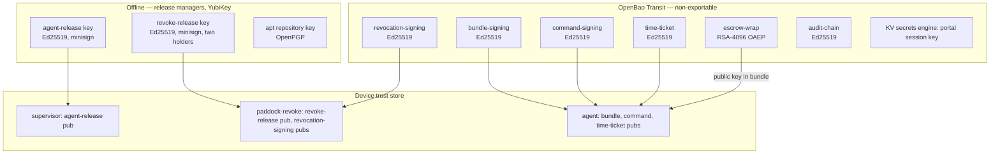

| Key | Used by (AppRole) | Rotation | Compromise impact |
| --- | --- | --- | --- |
| `bundle-signing` | `compiler` | yearly; new version published in bundles signed by old version, agents trust both for 30 d | attacker can push configuration (sudo, login); cannot revoke, cannot update agent |
| `command-signing` | `worker` | yearly | non-destructive commands only |
| `revocation-signing` | `revocation-issuer` | yearly | destructive; mitigated by rate limits inside `paddock-revoke` (max 1 per 24 h per device) and approval proofs |
| `time-ticket` | `compiler` | yearly | dead man's switch deferral only |
| `escrow-wrap` | encrypt: public key on devices; decrypt: `escrow-reader` (api, with step-up) and `revocation-recovery` (CLI, operator) | every 2 years, re-wrap job | escrowed passwords and headers readable |
| `audit-chain` | `audit-writer` | yearly | can forge future chain seals, cannot alter WORM objects |
| agent-release | offline | on compromise only, via supervisor package update (signed by apt key) | malicious agent; mitigated by staged rollout and offline storage |

### 13.2 Operations

- OpenBao runs with integrated Raft storage; **Shamir unseal 3 of 5**, shares held by named persons. A
  sealed OpenBao stops bundle signing and reveals; devices keep working (fail safe). Auto-unseal MAY
  be configured by the operator with a KMS of their choice (not bundled).
- Every role authenticates with its own AppRole; secret IDs are delivered as Docker secrets and are
  response-wrapped at provisioning.
- Key revocation: a key version is marked `revoked` in a signed trust-store update (part of the bundle,
  signed by a *different, still-valid* version); for `bundle-signing` compromise the recovery path is an
  agent release (offline key) that ships a new trust store.

---

## 14. Audit pipeline

### 14.1 Flow

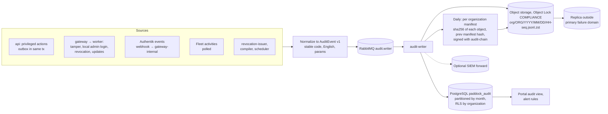

### 14.2 Event schema

```json
{
  "schema": "paddock.audit.v1",
  "event_id": "01J9Z…",
  "organization_id": "5c1e…",
  "occurred_at": "2026-10-03T08:15:00.123Z",
  "recorded_at": "2026-10-03T08:15:00.456Z",
  "code": "device.revocation.lock.requested",
  "outcome": "success",
  "actor": { "type": "admin", "id": "…", "display": "alice@example.org", "ip": "203.0.113.4", "step_up": true },
  "target": { "type": "device", "id": "0b6d…", "display": "lt-alice-01" },
  "source": "portal",
  "params": { "action": "lock" },
  "correlation_id": "…"
}
```

- `code` is a stable, dotted English identifier from a closed registry (`docs/compliance/audit-codes.md`,
  generated from `server/internal/domain/audit/codes.go`). `outcome ∈ {success, failure, denied, unknown}`.
- Events are never translated or rewritten; the portal localizes the display via message key
  `audit.<code>` with `params`.

### 14.3 Exactly one event per privileged action

Generated code tends to emit audit events on success only. The rule in the application layer:

1. A privileged use case starts by inserting an `action` row (`status = started`) in its transaction.
2. The domain change and the outbox record for the audit event are written **in the same transaction**,
   with the final `outcome`.
3. If the use case fails before commit, a second short transaction writes the `action` row with
   `outcome = failure|denied` and its outbox record. The middleware guarantees this through a deferred
   handler that runs when the use case returns an error.
4. For external side effects (Authentik, Fleet) the outbox event is written after the external call
   with its result; a crash between the call and the write leaves a `started` row that the scheduler
   finalizes after 10 min as `outcome = unknown` with an event.
5. `event_id` = `action_id`, so duplicates collapse at the index (`ON CONFLICT DO NOTHING`) and in WORM
   (the object key contains the event ID range; the daily manifest detects duplicates).

### 14.4 WORM store

- Bucket `paddock-audit`, created with Object Lock enabled, default retention **COMPLIANCE** mode with
  the platform minimum (default 400 days). Organization-specific longer retention is set per object at
  write time; deletion after retention is performed by a lifecycle rule. Shortening is impossible by design.
- The audit-writer's credential may `PutObject` and `PutObjectRetention` (extend only); no credential
  that any operator account uses has `DeleteObject` or `BypassGovernanceRetention`.
- Deployment checklist step "create production audit bucket" is a one-shot, verified by the acceptance gate.

---

## 15. Fleet and osquery integration (A10)

- Fleet free core, version pinned in Compose. Paddock uses only REST endpoints available in the free
  edition; the adapter has a contract test suite against the pinned version.
- **Port** `Inventory` in `server/internal/ports/inventory.go`:

```go
type Inventory interface {
    ListHostsChangedSince(ctx context.Context, since time.Time, cursor string) (HostPage, error)
    HostSoftware(ctx context.Context, ref HostRef) ([]SoftwarePackage, error)
    HostVulnerabilities(ctx context.Context, ref HostRef) ([]Vulnerability, error)
    HostPolicyResults(ctx context.Context, ref HostRef) ([]PolicyResult, error)
    ApplyPolicies(ctx context.Context, policies []PolicyDefinition) error
}
```

- **Mapping:** Fleet hosts are matched to Paddock devices by `hardware UUID` reported by both the agent
  (enrollment fingerprint) and osquery (`system_info.uuid`). Unmatched hosts are ignored and counted
  in a metric; Paddock never shows a Fleet host that is not a Paddock device.
- **Isolation:** Fleet has no organization concept in the free edition. Paddock never exposes Fleet's UI
  or API to organization admins. The adapter writes Fleet data into Paddock tables under the device's
  organization; all reads go through RLS.
- **fleetd enrollment:** one global Fleet enroll secret, delivered encrypted in the device bundle as a
  secret; fleetd package installed by the agent from the Paddock apt repository.
- **Policies** (osquery SQL) are defined in Paddock (`server/internal/inventory/policies/*.sql`) and pushed
  through the API; they are global, organization-specific thresholds are evaluated in Paddock.
- Replacing Fleet means implementing the port with another adapter; no Fleet IDs appear outside the adapter
  except in `device_inventory_ref.external_id`.

---

## 16. Data model

### 16.1 Core entities

```mermaid
erDiagram
  ORGANIZATION ||--o{ ADMIN_ACCOUNT : has
  ORGANIZATION ||--o{ APP_USER : has
  ORGANIZATION ||--o{ USER_GROUP : has
  ORGANIZATION ||--o{ DEVICE : has
  ORGANIZATION ||--o{ DEVICE_GROUP : has
  ORGANIZATION ||--o{ PERMISSION_PROFILE : has
  ORGANIZATION ||--o{ ENROLLMENT_TOKEN : issues
  ORGANIZATION ||--|| ORGANIZATION_SETTINGS : configures
  ORGANIZATION ||--o{ CHANGE_SET : records

  APP_USER }o--o{ USER_GROUP : "group_membership"
  DEVICE }o--o{ DEVICE_GROUP : "device_group_member"
  DEVICE ||--o{ DEVICE_IDENTITY_KEY : authenticates
  DEVICE ||--o{ LOGIN_ASSIGNMENT : allows
  DEVICE ||--o{ BUNDLE : receives
  DEVICE ||--o{ COMMAND : receives
  DEVICE ||--o{ ESCROW_SECRET : escrows
  DEVICE ||--|| DEVICE_STATUS : materializes
  DEVICE ||--o{ TAMPER_FINDING : raises
  DEVICE ||--o{ INSTALLED_SOFTWARE : reports

  PERMISSION_PROFILE ||--o{ PROFILE_ASSIGNMENT : assigned
  PROFILE_ASSIGNMENT }o--o| DEVICE_GROUP : "scoped to"
  COMMAND ||--o{ APPROVAL : requires

  ORGANIZATION {
    uuid id PK
    text slug UK
    text name
    text status
  }
  APP_USER {
    uuid id PK
    uuid organization_id FK
    text authentik_pk UK
    text username UK
    text source "local|synced"
    bool locked
    text locale
  }
  USER_GROUP {
    uuid id PK
    uuid organization_id FK
    text authentik_pk
    text name
    text source "local|synced"
  }
  DEVICE {
    uuid id PK
    uuid organization_id FK
    text hostname
    text state "pending|active|quarantined|retired"
    bigint bundle_seq
    bool login_suspended
    text hardware_uuid
    text key_protection "tpm|file"
  }
  DEVICE_IDENTITY_KEY {
    text key_id PK
    uuid device_id FK
    uuid organization_id FK
    bytea public_key
    text status "active|rotating|revoked"
  }
  PERMISSION_PROFILE {
    uuid id PK
    uuid organization_id FK
    text name
    text class "none|restricted|full"
    jsonb commands
    jsonb scalars
  }
  PROFILE_ASSIGNMENT {
    uuid id PK
    uuid organization_id FK
    uuid profile_id FK
    text subject_type "global|group|user"
    uuid subject_id "null for global"
    uuid device_group_id "nullable"
  }
  LOGIN_ASSIGNMENT {
    uuid id PK
    uuid organization_id FK
    uuid device_id FK
    text subject_type "user|group"
    uuid subject_id
  }
  BUNDLE {
    uuid device_id FK
    bigint version
    uuid organization_id FK
    bytea content_sha256
    text object_key
    timestamptz created_at
  }
  COMMAND {
    uuid id PK
    uuid organization_id FK
    uuid device_id FK
    text type
    jsonb params
    text status "pending|delivered|succeeded|failed|expired|cancelled"
    timestamptz expires_at
  }
  APPROVAL {
    uuid id PK
    uuid command_id FK
    uuid organization_id FK
    uuid admin_id
    text stepup_id_token_jti
    timestamptz approved_at
  }
  ESCROW_SECRET {
    uuid id PK
    uuid organization_id FK
    uuid device_id FK
    text kind "admin_password|luks_header|recovery_key"
    int generation
    text status "stored|active|superseded|destroyed"
    bytea wrapped_dek
    text object_key
  }
```

Additional tables (not drawn): `organization_settings`, `change_set` (author, timestamp, YAML diff,
reason), `outbox`, `action`, `alert`, `device_status`, `tamper_finding`, `installed_software`,
`vulnerability_finding`, `policy_result`, `device_inventory_ref`, `agent_release`, `rollout_wave`,
`revocation_request`, `enrollment_token`, `effective_profile_cache`.

### 16.2 Conventions

- Primary keys UUIDv7 (time-ordered) generated in Go; timestamps `timestamptz` in UTC.
- Migrations with **goose** (`server/migrations/NNNNN_name.sql`), forward-only in production; each migration
  ships with a test that applies it to the previous schema with fixture data.
- SQL access with **sqlc** + **pgx/v5**; no ORM. Every generated query runs inside `db.InOrg`.

---

## 17. APIs

### 17.1 Admin API

- REST + JSON, **OpenAPI 3.1** contract in `api/openapi/admin.yaml` (source of truth); server stubs via
  `oapi-codegen`, TypeScript client via `openapi-typescript` + `openapi-fetch`.
- Base path `/api/v1`; organization from session; errors as RFC 9457 problem details with a stable `code`.
- Declarative configuration: `PUT /api/v1/config` accepts the organization's full or partial declarative
  document (`paddock.yml` schema `api/schema/paddock.v1.json`); `POST /api/v1/config:plan` returns the diff
  without applying. Portal forms and `paddockctl apply -f paddock.yml` call the **same** endpoints, which
  is how "the portal writes through the same path" is realized (ADR 0011).
- Idempotency: all POSTs that create commands or revocations require `Idempotency-Key`.

### 17.2 Device API

See §6.8; contract in `api/openapi/device.yaml`; Go types shared with the agent in `pkg/protocol`.

### 17.3 Git export (optional)

A worker job serializes each change set into `orgs/<slug>/paddock.yml` and pushes to a configured Git
remote with a deploy key per organization. Import from Git is **not** automatic; operators use
`paddockctl apply` in their CI against the API with an API token (scoped, audited).

---

## 18. Portal and internationalization

- **Vue 3 + TypeScript + Vite**, Pinia for state, Vue Router, component library **PrimeVue** (MIT) with
  its unstyled/passthrough mode for accessibility control. Served as static files by the `api` role.
- **i18n:** `vue-i18n` with a custom message compiler backed by **`intl-messageformat`** (FormatJS) so
  that all messages are ICU MessageFormat. Catalogs `web/src/locales/en.json` (source) and later `de.json`.
  User language stored on the admin account; UTC everywhere, formatting with `Intl.DateTimeFormat` in the browser.
- **Lint rules:** no string literals in templates (`@intlify/vue-i18n/no-raw-text`), CI fails on missing
  `en` keys and on unused keys.
- **Accessibility:** WCAG 2.1 AA as the target; axe checks in Playwright tests.
- **Security headers:** strict CSP (`default-src 'self'`), no inline scripts, `frame-ancestors 'none'`.

Key screens: Devices (status, last contact, compliance, commands), Device detail (bundle version,
effective sudo per user, tamper findings, escrow actions), Users & Groups (source badge, lock),
Profiles (editor with root-equivalent warning, effective-profile view with derivation), Updates
(holds, schedules, immediate install), Audit (search, export), Settings (staleness, DMS, login options, retention).

---

## 19. Observability (A12)

Strictly separate from the audit log.

| Signal | Implementation |
| --- | --- |
| Metrics | Prometheus endpoint `/metrics` per role (port 9090, internal only); key series: check-ins/s, signature failures by reason, ingest lag per consumer, compile latency, bundles signed/s, OpenBao latency, staleness counts, rollout failure rate |
| Traces | OpenTelemetry SDK, OTLP export to an operator-provided collector (optional in Compose) |
| Logs | JSON to stdout (`log/slog`), no secrets, no request bodies of device endpoints |
| Health | `/healthz` (process alive), `/readyz` (dependencies reachable for the role) |
| Agent | `paddockd` exposes health over a Unix socket for the supervisor; its metrics are summarized in the check-in `health` field, not scraped |

---

## 20. Backup and restore (A11)

| Data | Method | RPO | RTO |
| --- | --- | --- | --- |
| PostgreSQL `paddock`, Authentik DB | pgBackRest, continuous WAL archive + daily full to a separate bucket | 5 min | 4 h |
| OpenBao | Raft snapshot every 6 h and after every key operation, encrypted, to the backup bucket; unseal shares offline | 6 h (keys change rarely) | 4 h |
| Escrow bucket | bucket versioning + replication to the backup site | 15 min | 4 h |
| Bundles bucket | not backed up; recompiled from PostgreSQL (`paddockctl admin recompile --all`) | – | 1 h |
| RabbitMQ | not backed up; quorum queues replicated on 3 nodes; devices re-send heartbeats and spooled events; definitions (exchanges, queues, users) are code (`paddock-server provision rabbitmq`) | – | – |
| Valkey | not backed up; rebuilt from PostgreSQL (`paddockctl admin rebuild-cache`) | – | 15 min |
| Fleet MySQL | daily dump; rebuildable from devices within 24 h | 24 h | 8 h |
| Audit store | **excluded** from routine restore; protected by WORM + replica | – | – |

**Restore rule:** after a PostgreSQL restore, `device.bundle_seq` could go backwards and devices would
reject new bundles as downgrades. The restore runbook therefore runs `paddockctl admin bump-bundle-seq
--by 1000000` before the compiler starts. A restore drill is part of the release checklist (quarterly).

---

## 21. Version compatibility (A7)

- Device API in the path (`/v1`). Additive changes only within a major; a `/v2` runs alongside `/v1` for
  at least 12 months.
- Agent reports `schema_versions` it supports; the compiler renders the newest schema in that set.
- **Support window:** the server supports agents of the current and previous two minor releases and
  anything released in the last 6 months, whichever is wider.
- An agent outside the window gets 426 `agent_unsupported` on check-in **with** an `agent_update` pointer;
  it keeps the last applied state, updates through the supervisor and reports. The portal shows such
  devices as `agent_outdated` (never silent).
- Server upgrades MUST NOT remove support for an agent version that more than 1 % of active devices
  still run; the migration tool refuses the upgrade and lists the devices.

---

## 22. Test strategy

| Level | Tooling | What is tested where |
| --- | --- | --- |
| Unit (Go) | `go test`, `pgregory.net/rapid` for property tests | Domain logic: profile merge (order independence, union, max class, root-equivalence), bundle canonicalization, signature verification, time ticket logic, DMS elapsed-time calculation, reconciler `Plan()` |
| Integration (Go) | `testcontainers-go` with PostgreSQL, RabbitMQ, Valkey, OpenBao, the object store of ADR 0017, Authentik | Repositories with RLS (fail-closed without context), outbox → RabbitMQ → consumers idempotency (including duplicate delivery), compiler end-to-end, OpenBao signing, Authentik adapter against a real instance |
| Contract | OpenAPI validation (`kin-openapi`) on every handler test; Fleet adapter contract tests against the pinned Fleet version | Schema drift |
| Isolation | Generated test over all OpenAPI operations: principal of org A, IDs of org B → 404 | F10 gate |
| Golden | Rendered `sudoers` and `himmelblau.conf` vs. golden files, then `visudo -c` in a container | F11 gate |
| Agent system tests | VMs defined as code: Vagrant + libvirt/QEMU with **swtpm** (emulated TPM2), Ubuntu 26.04 and 24.04 | idempotency (second run changes nothing), sudo rollback, A/B update and watchdog rollback, suspension, local admin rotation with forced confirmation failure, DMS with clock manipulation |
| Real hardware | Dedicated test laptops | TPM2+PIN, Lock + restore from header, Destroy, revocation confirmation before reboot |
| Frontend | Vitest + Vue Test Utils; Playwright e2e against Compose stack incl. axe | UI flows, i18n completeness, step-up flows |
| Load | k6 scripts against `gateway` | N1, N2, check-in jitter (no spikes after simulated outage) |
| Acceptance | `test/acceptance/` Go test suite that orchestrates Compose stack + VMs; one test file per gate of the concept | Definition of done for each milestone |

CI: GitHub Actions (or Forgejo Actions), `golangci-lint`, `govulncheck`, `gosec`, SBOM (`syft`), container
image signing with `cosign` using a key held in the CI secret store.

---

## 23. Repository layout

```
paddock/
├── CLAUDE.md
├── go.work                      # workspace: server, agent, cli, pkg
├── api/
│   ├── openapi/admin.yaml
│   ├── openapi/device.yaml
│   └── schema/paddock.v1.json   # declarative configuration schema
├── pkg/                         # shared Go module: protocol, bundle, dsse, canonicaljson, hpke
├── server/
│   ├── cmd/paddock-server/
│   ├── internal/{domain,app,ports,adapters,transport,compiler,inventory,audit}/
│   ├── migrations/
│   └── web/                     # Vue 3 portal
├── agent/
│   ├── cmd/{paddockd,paddock-supervisor,paddock-revoke}/
│   └── internal/{reconcile,checkin,events,supervisor,revoke,luks,login}/
├── cli/cmd/paddockctl/
├── packaging/debian/            # paddock-agent, paddock-supervisor, paddock-revoke, fleetd
├── deploy/compose/
├── docs/{architecture.md,adr/,operations/,compliance/}
├── examples/                    # example paddock.yml, example playbooks — never operator data
└── test/{vms/,acceptance/,load/}
```

`agent/internal/revoke/` and `agent/cmd/paddock-revoke/` are listed in `CODEOWNERS` with two required reviewers.
The concept's `ansible/roles/` is not created: the apply engine is native; organization playbooks belong
to the operator's private repository (concept: operator configuration never in the product repository).

---

## 24. Milestones

| Milestone | Content | Gate(s) |
| --- | --- | --- |
| **M0 Foundations** | Repo skeleton, Compose stack (PostgreSQL, RabbitMQ, OpenBao, object storage per ADR 0017, Authentik), WORM acceptance test against the chosen object store, org model with RLS, admin login via Authentik, outbox + audit-writer, OpenAPI pipeline | Organization isolation, Portal (audit exactly once) |
| **M1 PoC gate (parallel to M0)** | Himmelblau ↔ Authentik PoC 1–5 (item 5: local user lock offline and at screen unlock, §9.5); TPM2+PIN on 26.04 and 24.04 with dracut | A2 decision |
| **M2 Device core** | Enrollment, identity, check-in, compiler, bundle signing, agent with `file`, `systemd_unit`, `time`, supervisor A/B | Configuration idempotency, Agent update, Agent outage |
| **M3 Identity & privileges** | User/group management, Authentik adapter, lock (Authentik + local device lock with session lock screen), event-triggered check-ins, login assignment, suspension, profiles, sudo reconciler | Identity, Login suspension, Effective profile |
| **M4 Device controls** | Local admin rotation + reveal, LUKS escrow, Lock/Destroy, revocation-issuer, mass-revocation limits, DMS | Local administrator, Revocation, Mass revocation |
| **M5 Inventory & updates** | Fleet adapter, vulnerability view, holds, schedules, immediate install, staleness | Scalability, F4, F6, F12 |
| **M6 Hardening & release** | Load tests, restore drill, German locale, documentation, compliance pack | All gates |

Implementation plans for the coding agent are written per milestone, following `.claude/agents/architect.md` § 6.

---

## 25. Open points and risks

### 25.1 Open decisions (with chosen default)

| # | Question | Default until decided |
| --- | --- | --- |
| O1 | **A2 Himmelblau PoC** outcome, including item 5 (offline and screen-unlock enforcement of a local user lock, §9.5) | Design supports both; bundle `login.provider` discriminator; SSSD fallback; `pam_listfile` deny list if item 5 fails |
| O2 | **A14 boot PIN vs. login PIN** after UX test | Both technically supported; per-organization setting `pin_model: tpm_pin_only \| tpm_pin_and_hello_pin`; default `tpm_pin_and_hello_pin` |
| O3 | **Object storage — decided: RustFS (ADR 0017, accepted).** The concept names MinIO. MinIO stopped publishing community images and binaries in October 2025, put the community edition into maintenance mode in December 2025 and archived the repository in 2026; the Docker Hub images no longer resolve. It can therefore not be the bundled component. The Paddock code is unaffected (it uses only the S3 API with Object Lock). Candidates: **Ceph RGW** (LGPL, mature Object Lock, heavy to operate), **RustFS** (Apache-2.0, 1.0 GA in September 2026, had an Object Lock enforcement CVE before 1.0), **SeaweedFS** (Apache-2.0, recent issues with COMPLIANCE enforcement on delete), **external S3** of a provider with Object Lock. **Decision owner:** product owner, on the architect's recommendation (ADR 0017). **Verification:** not the Himmelblau PoC, but the audit acceptance gate ("an event in WORM storage cannot be deleted, even with admin credentials") run against the chosen product in M0. | Proposed: RustFS for bundles + escrow and as default audit store, gated by the WORM acceptance test in M0; Ceph RGW or external S3 documented for operators who need a proven WORM store. If RustFS fails the gate, Ceph RGW becomes the default |
| O4 | Ubuntu 24.04 TPM2+PIN via dracut | Supported only via Paddock autoinstall; PoC in M1 |
| O5 | Shared devices: attribution when several users log in | Login assignment by group; audit carries the session user |
| O6 | Hardware reissue process (re-enrollment, re-encryption, deletion evidence) | Retire → Destroy (two-person) → re-image → new enrollment; evidence = Destroy audit events; runbook in M6 |
| O7 | Permanently offline devices | `presumed_lost` after critical staleness; admin action list; optional auto-destroy after Lock |
| O8 | Fleet free edition API surface stability | Contract tests on the pinned version; upgrade only with passing contract suite |

### 25.2 Risks added by this architecture

| Risk | Impact | Mitigation |
| --- | --- | --- |
| RLS misconfiguration (table without policy) | Cross-organization leak | Migration lint: CI fails if any table with `organization_id` lacks `ENABLE ROW LEVEL SECURITY` + `FORCE ROW LEVEL SECURITY` + policy; isolation gate |
| OpenBao sealed after restart | Bundles and reveals stop | Fail safe on devices; alerting; documented unseal procedure; optional auto-unseal |
| Authentik superuser sees all organizations | Insider risk across organizations | Authentik admin accounts limited to platform operators; Authentik admin events forwarded to the audit pipeline |
| Self-lock token for DMS lives on the device before it is needed | A root user could trigger an early self-lock of their own device | Token encodes `elapsed ≥ period`; abuse only harms the user's own device and is visible in audit; acceptable |
| One binary with many roles | A bug in shared code affects all roles | Role-specific OpenBao and DB credentials limit blast radius; separate container per role |
| RabbitMQ or Valkey outage | Ingest or check-ins stop | 3-node RabbitMQ cluster with quorum queues, Valkey with replica + Sentinel; devices continue working (C2); agent spool covers 50 MiB of events |
| No broker-side deduplication in RabbitMQ | Duplicate processing | Natural keys + `ON CONFLICT DO NOTHING` in every consumer; duplicate-delivery integration tests per consumer |
